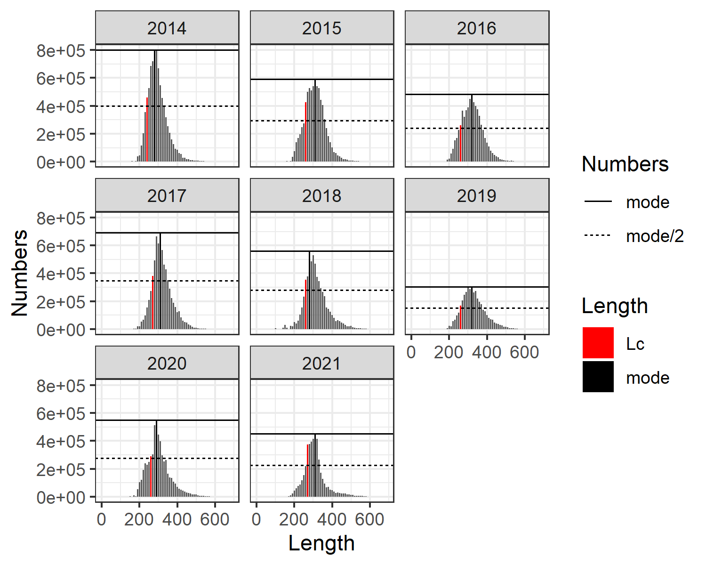
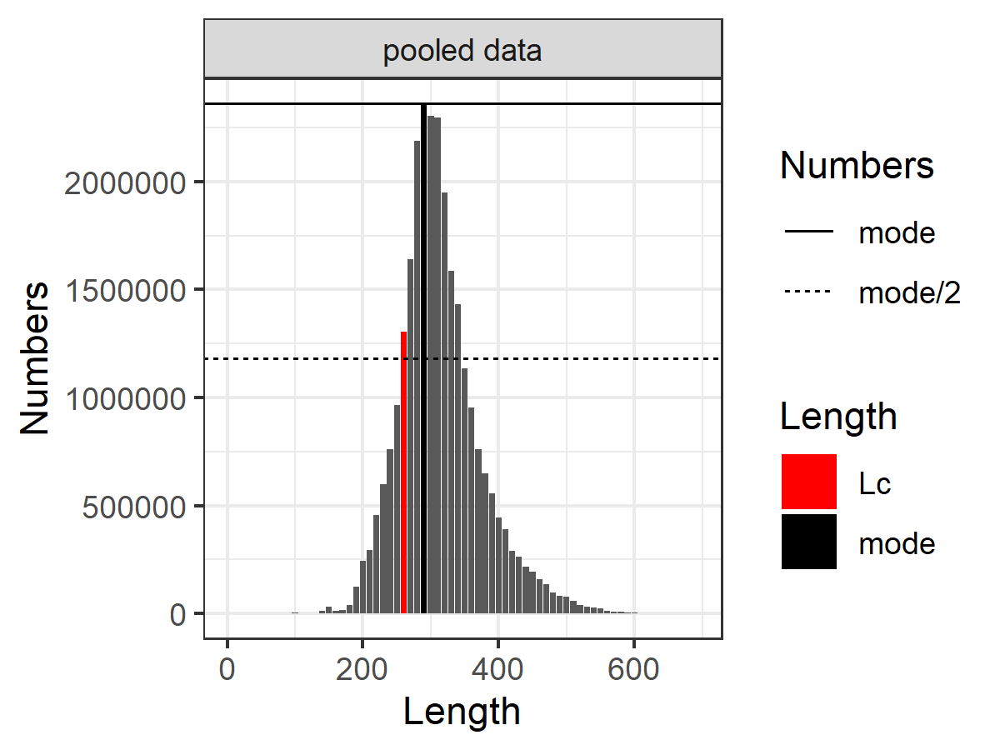
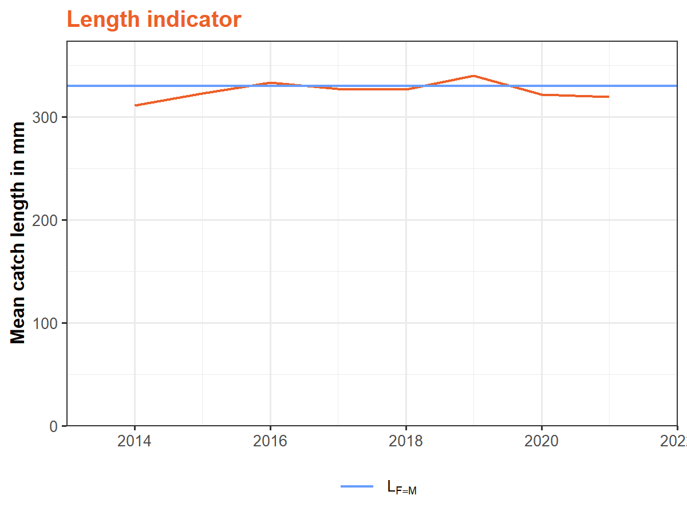
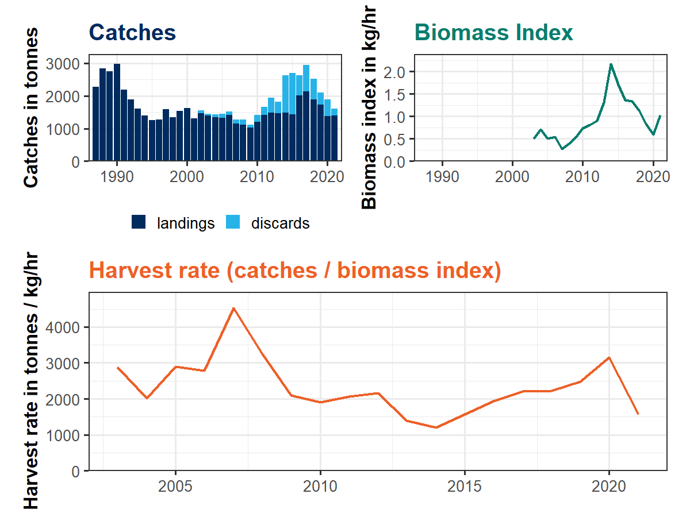
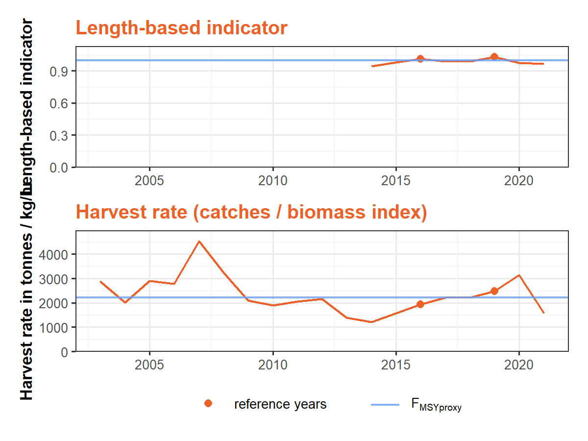

-   <a href="#cat3advice" id="toc-cat3advice"><code>cat3advice</code></a>
-   <a href="#documentation" id="toc-documentation">Documentation</a>
-   <a href="#installation" id="toc-installation">Installation</a>
-   <a href="#tutorial" id="toc-tutorial">Tutorial</a>
-   <a href="#the-rfb-rule" id="toc-the-rfb-rule">The rfb rule</a>
    -   <a href="#reference-catch-a_y" id="toc-reference-catch-a_y">Reference
        catch <em>A</em><em>y</em></a>
    -   <a href="#biomass-index-trend-ratio-r"
        id="toc-biomass-index-trend-ratio-r">Biomass index trend (ratio) <em>r</em></a>
    -   <a href="#biomass-safeguard-b" id="toc-biomass-safeguard-b">Biomass
        safeguard <em>b</em></a>
    -   <a href="#fishing-pressure-proxy-f"
        id="toc-fishing-pressure-proxy-f">Fishing pressure proxy <em>f</em></a>
    -   <a href="#multiplier-m" id="toc-multiplier-m">Multiplier <em>m</em></a>
    -   <a href="#application-of-rfb-rule"
        id="toc-application-of-rfb-rule">Application of rfb rule</a>
-   <a href="#the-rb-rule" id="toc-the-rb-rule">The rb rule</a>
    -   <a href="#reference-catch-a_y-1"
        id="toc-reference-catch-a_y-1">Reference catch <em>A</em><em>y</em></a>
    -   <a href="#biomass-index-trend-ratio-r-1"
        id="toc-biomass-index-trend-ratio-r-1">Biomass index trend (ratio) <em>r</em></a>
    -   <a href="#biomass-safeguard-b-1" id="toc-biomass-safeguard-b-1">Biomass
        safeguard <em>b</em></a>
    -   <a href="#multiplier-m-1" id="toc-multiplier-m-1">Multiplier <em>m</em></a>
    -   <a href="#application-of-rb-rule"
        id="toc-application-of-rb-rule">Application of rb rule</a>
-   <a href="#the-chr-rule" id="toc-the-chr-rule">The chr rule</a>
    -   <a href="#reference-catch-a_y-2"
        id="toc-reference-catch-a_y-2">Reference catch <em>A</em><em>y</em></a>
    -   <a href="#biomass-index-value-i_y-1"
        id="toc-biomass-index-value-i_y-1">Biomass index value <em>I</em><em>y</em> − 1</a>
    -   <a href="#biomass-safeguard-b-2" id="toc-biomass-safeguard-b-2">Biomass
        safeguard <em>b</em></a>
    -   <a href="#target-harvest-rate-f_textproxymsy"
        id="toc-target-harvest-rate-f_textproxymsy">Target harvest rate <em>F</em>proxyMSY</a>
    -   <a href="#multiplier-m-2" id="toc-multiplier-m-2">Multiplier <em>m</em></a>
    -   <a href="#application-of-chr-rule"
        id="toc-application-of-chr-rule">Application of chr rule</a>
-   <a href="#references" id="toc-references">References</a>

# `cat3advice`

`cat3advice` is an R package that allows the application of the ICES
category 3 data-limited harvest control rules (rfb/rb/chr rules) and
follows the ICES Technical Guidelines (ICES 2022)
(<https://doi.org/10.17895/ices.advice.19801564>).

# Documentation

The package documentation contains help files for its functions which
also include code examples. See `help(package = "cat3advice")` for
available functions.

The main functions are `rfb()`, `rb()`, and `chr()`. Each of these
functions has a help file with code examples (see `?rfb`, `?rb` `?chr`).

# Installation

The latest version of the `cat3advice` R package can be installed from
GitHub with

    library(remotes)
    install_github("shfischer/cat3advice", build_vignettes = TRUE)

# Tutorial

This tutorial uses data from the ICES Western English Channel plaice
stock (ple.27.7e) to illustrate the application of the rfb/rb/chr rules.
The data are included in the `cat3advice` R package.

Before reading this vignette, please first read the ICES Technical
Guidelines (ICES 2022).

For more details on the rfb rule, please refer to Fischer et al. (2020;
2021b, 2021a, 2023) and for the chr rule, please refer to Fischer et al.
(2022, 2023).

    ### load package
    library(cat3advice)

# The rfb rule

The rfb rule is an index adjusted harvest control rule that uses a
biomass index and catch length data. The method is defined as Method 2.1
in the ICES Technical Guidelines (ICES 2022, 9) as

*A**y* + 1 = *A**y* × *r* × *f* × *b* × *m*

where *A**y* + 1 is the new catch advice, *A**y*
the previous advice, *r* the biomass ratio from a biomass index, *f* the
fishing pressure proxy from catch length data, *b* a biomass safeguard
and *m* a precautionary multiplier. Furthermore, the change in the
advice is restricted by a stability clause that only allows changes of
between  + 20% and  − 30% relative to the previous advice, but the
application of the stability clause is conditional on *b* = 1 and turned
off when *b* &lt; 1.

The rfb rule should be applied biennially, i.e. the catch advice is
valid for two years.

Please note that any change from the default configuration should be
supported by case-specific simulations.

## Reference catch *A**y*

The reference catch *A**y* is usually the most recently
advised catch. In a typical ICES setting, an assessment is conducted in
an assessment (intermediate) year *y* to give advice for the following
advice year *y* + 1, this is the advice for year *y*:

    ### load plaice catch and advice data
    data("ple7e_catch")
    tail(ple7e_catch)
    #>    year advice landings discards catch
    #> 31 2017   2714     2128      821  2949
    #> 32 2018   3257     1880      633  2513
    #> 33 2019   3648     1725      366  2091
    #> 34 2020   2721     1373      514  1888
    #> 35 2021   2177     1403      211  1615
    #> 36 2022   1742       NA       NA    NA
    ### get reference catch
    A <- A(ple7e_catch, units = "tonnes")
    A
    #> An object of class "A".
    #> Value: 1742

The ICES Technical Guidelines (ICES 2022) specify that if the realised
catch is very different from the advised catch, the reference catch
could be replaced by an average of recent catches:

    ### use 3-year average
    A(ple7e_catch, units = "tonnes", basis = "average catch", avg_years = 3)
    #> An object of class "A".
    #> Value: 1864.66666666667

The reference catch can also be defined manually:

    ### use 3-year average
    A(2000, units = "tonnes")
    #> An object of class "A".
    #> Value: 2000

## Biomass index trend (ratio) *r*

The biomass index trend *r* calculates the trend in the biomass index
over last the five years, by dividing the mean of the last two years by
the mean of the three preceding years:

*r* = *Σ**i* = *y* − 2*y* − 1(*I**i*/2) / *Σ**i* = *y* − 5*y* − 2(*I**i*/3)

The ratio is calculated with the function `r`. Index data should be
provided as a `data.frame` with columns `year` and `index`.

    ### load plaice data
    data("ple7e_idx")
    tail(ple7e_idx)
    #>    year     index
    #> 14 2016 1.3579990
    #> 15 2017 1.3323659
    #> 16 2018 1.1327596
    #> 17 2019 0.8407277
    #> 18 2020 0.5996326
    #> 19 2021 1.0284297

    ### calculate biomass trend
    r <- r(ple7e_idx, units = "kg/hr")
    r
    #> An object of class "rfb_r".
    #> Value: 0.73871806243358

    ### ICES advice style table
    advice(r)
    #> --------------------------------------------------------------------------------
    #> Stock biomass trend
    #> --------------------------------------------------------------------------------
    #> Index A (2020,2021)                              |                    0.81 kg/hr
    #> Index B (2017,2018,2019)                         |                    1.10 kg/hr
    #> r: stock biomass trend (index ratio A/B)         |                          0.74

    ### plot index
    ### horizontal orange lines correspond to the the 2/3-year averages
    plot(r)

    ### when the value of r is known
    r(1)
    #> An object of class "r".
    #> Value: 1

Biomass index data are usually available until the year before the
advice year. More recent data can be used and the function automatically
picks the most recent data provided to it.

## Biomass safeguard *b*

The biomass safeguard reduces the advice when the biomass index *I*
falls below a threshold value *I*trigger:

*b* = min{1, *I**y* − 1/*I*trigger}
By default, the trigger value is defined based on the lowest observed
index value *I*loss as
*I*trigger = 1.4*I*loss.

The biomass safeguard is calculated with the function `b`:

    ### use same plaice data as before
    ### application in first year with new calculation of Itrigger
    b <- b(ple7e_idx, units = "kg/hr")
    b
    #> An object of class "b".
    #> Value: 1

    ### ICES advice style table
    advice(b)
    #> --------------------------------------------------------------------------------
    #> Biomass safeguard
    #> --------------------------------------------------------------------------------
    #> Last index value (I2021)                         |                    1.03 kg/hr
    #> Index trigger value (Itrigger = Iloss x 1.4)     |                    0.39 kg/hr
    #> b: index relative to trigger value,              |                          1.00
    #>    min{I2021/Itrigger, 1}                        |

    ### plot
    plot(b)

    ### plot b and r in one figure
    plot(r, b)

**Please note that *I*trigger should only be defined once in
the first year of the application of the rfb rule**. In the following
years, the same value should be used. For this purpose, `b` allows the
direct definition of *I*trigger, or, more conveniently,
*I*trigger can be based on the year in which
*I*loss is defined:

    ### in following years, Itrigger should NOT be updated
    ### i.e. provide value for Itrigger
    b(ple7e_idx, units = "kg/hr", Itrigger = 0.3924721)
    #> An object of class "b".
    #> Value: 1
    ### alternatively, the reference year for Iloss can be used
    b(ple7e_idx, units = "kg/hr", yr_ref = 2007)
    #> An object of class "b".
    #> Value: 1

## Fishing pressure proxy *f*

Catch length data are used to approximate the fishing pressure. The mean
length of fish in the catch compared to a reference length is used as
the indicator.

### Length data

The fishing pressure proxy requires length data from the catch. Ideally,
length data for several years are provided in a `data.frame` with
columns `year`, `length` and `numbers`. An additional column
`catch_category` specifying the catch category, such as discards and
landings, is optional.

    data("ple7e_length")
    head(ple7e_length)
    #>   year             catch_category length numbers
    #> 1 2018                BMS landing    100    0.00
    #> 2 2018                   Discards    100 5887.55
    #> 3 2018 Logbook Registered Discard    100    0.00
    #> 4 2015                   Discards    120  128.60
    #> 5 2016                BMS landing    140    0.00
    #> 6 2018                BMS landing    140    0.00

### Length at first capture *L**c*

Only length data above the length at first capture *L**c* are
used to avoid noisy data from fish that are not fully selected.
*L**c* is defined as the first length class where the
abundance is at or above 50% of the mode of the length distribution and
can be calculated with the function `Lc()`:

    lc <- Lc(ple7e_length)
    lc
    #> 2014 2015 2016 2017 2018 2019 2020 2021 
    #>  240  260  260  270  260  260  260  270
    plot(lc)

*L**c* can change from year to year. Therefore, it is
recommended to pool data from several (e.g. 5) years:

    lc <- Lc(ple7e_length, pool = 2017:2021)
    lc
    #> [1] 260
    plot(lc)

If length data are noisy, the size of the length classes can be
increased:

    ### use 20mm length classes
    plot(Lc(ple7e_length, pool = 2017:2021, lstep = 20))

Once defined, *L**c* should be kept constant and the same
value used for all data years. *L**c* should only be changed
if there are strong changes in the fishery or data.

### Mean length

After defining *L**c*, the mean (annual) catch length
*L*mean above *L**c* can be calculated:

    ### calculate annual mean length
    lmean <- Lmean(data = ple7e_length, Lc = lc, units = "mm")
    lmean
    #>     2014     2015     2016     2017     2018     2019     2020     2021 
    #> 310.6955 322.8089 333.1876 326.9434 326.5741 339.8752 321.5979 319.1974
    plot(lmean)

If length data are noisy, the size of the length classes can be
increased:

    ### use 20mm length classes
    plot(Lmean(data = ple7e_length, Lc = lc, units = "mm", lstep = 20))

### Reference length

The reference length follows the concepts of Beverton and Holt (1957)
and is calculated as derived by Jardim, Azevedo, and Brites (2015):

*L**F* = *M* = 0.75*L**c* + 0.25*L*∞
where *L**F* = *M* is the MSY reference length,
*L**c* the length at first capture as defined above, and
*L*∞ the von Bertalanffy asymptotic length. This simple
equation assumes that fishing at *F* = *M* can be used as a proxy for
MSY and that *M*/*k* = 1.5 (where *M* is the natural mortality and *k*
the von Bertalanffy individual growth rate). The reference length can be
calculated with

    lref <- Lref(Lc = 264, Linf = 585, units = "mm")
    lref
    #> [1] 344.25

The reference length *L**F* = *M* should only be defined once
in the first year of the application of the rfb rule. In the following
years, the same value should be used.

Deviations from the assumptions of *F* = *M* and *M*/*k* = 1.5 are
possible following Equation A.3 of Jardim, Azevedo, and Brites (2015)
*L**F* = *γ**M*, *k* = *θ**M* = (*θ**L*∞+*L**c*(*γ*+1))/(*θ*+*γ*+1)
and can be used by providing arguments `gamma` and `theta` to `Lref()`.

### Indicator

The length indicator *f* is defined as

*f* = *L*mean/*L**F* = *M*

and can be calculated with `f()`:

    f <- f(Lmean = lmean, Lref = lref, units = "mm")
    f
    #> An object of class "f".
    #> Value: 0.927225455656142
    ### ICES advice style table
    advice(f)
    #> --------------------------------------------------------------------------------
    #> Fishing pressure proxy
    #> --------------------------------------------------------------------------------
    #> Mean catch length (Lmean = L2021)                |                        320 mm
    #> MSY proxy length (LF=M)                          |                        340 mm
    #> f: Fishing pressure proxy relative to MSY proxy  | 
    #>    (L2021/LF=M)                                  |                          0.93
    ### plot
    plot(f)

In this case, the mean catch length (orange curve) is always below the
MSY proxy reference length (blue horizontal line), indicating that the
fishing pressure was above *F*MSY.

## Multiplier *m*

The multiplier *m* is a tuning parameter and ensures that the catch
advice is precautionary in the long term.

The value of *m* is set depending on the von Bertalanffy parameter *k*
(individual growth rate), with *m* = 0.95 for stocks with
*k* &lt; 0.2/year and *m* = 0.90 for stocks with
0.2year−1 ≤ *k* &lt; 0.32year−1. The multiplier
can be calculated with the function `m()`:

    # for k=0.1/year
    m <- m(hcr = "rfb", k = 0.1)
    #> Multiplier (m) for the rfb rule: selecting value based on k: m=0.95
    m
    #> An object of class "m".
    #> Value: 0.95

    ### alias for rfb rule
    rfb_m(k = 0.1)
    #> Multiplier (m) for the rfb rule: selecting value based on k: m=0.95
    #> An object of class "rfb_m".
    #> Value: 0.95

    ### ICES advice style table
    advice(m)
    #> --------------------------------------------------------------------------------
    #> Precautionary multiplier to maintain biomass above Blim with 95% probability
    #> --------------------------------------------------------------------------------
    #> m: multiplier                                    |                          0.95
    #>    (generic multiplier based on life history)    |

Please note that the multiplier *m* does not lead to a continuous
reduction in the catch advice. The components of the rfb rule are
multiplicative, this means that *m* could be considered as part of
component *f* and essentially adjusts the reference length
*L**F* = *M* to *L*′*F* = *M*:

$$
A\_{y+1} = A\_y\\ r\\ f\\ b\\ m = A\_y\\ r\\ \frac{L\_{\text{mean}}}{L\_{F=M}}\\ b\\ m = A\_y\\ r\\ \frac{L\_{\text{mean}}}{L\_{F=M}/m}\\ b = A\_y\\ r\\ \frac{L\_{\text{mean}}}{L'\_{F=M}}\\ b
$$

## Application of rfb rule

Now we have all the components of the rfb rule and can apply it:

    advice <- rfb(A = A, r = r, f = f, b = b, m = m, discard_rate = 27)
    advice
    #> An object of class "rfb".
    #> Value: 1219.4

A discard rate in % can be provided to the argument `discard_rate` and
this means the advice is provided for the catch and landings.

The rfb rule includes a stability clause that restricts changes to
 + 20% and  − 30%. This stability clause is conditional on the biomass
safeguard and is only applied if *b* = 1 but turned off when *b* &lt; 1.

`cat3advice` can print a table similar to the table presented in ICES
advice sheets in which all numbers are rounded following ICES rounding
rules:

    advice(advice)
    #> --------------------------------------------------------------------------------
    #> Previous catch advice Ay (advised catch for 2022) |                   1742 tonnes
    #> --------------------------------------------------------------------------------
    #> Stock biomass trend
    #> --------------------------------------------------------------------------------
    #> Index A (2020,2021)                              |                      0.81 rfb
    #> Index B (2017,2018,2019)                         |                      1.10 rfb
    #> r: stock biomass trend (index ratio A/B)         |                          0.74
    #> --------------------------------------------------------------------------------
    #> Fishing pressure proxy
    #> --------------------------------------------------------------------------------
    #> Mean catch length (Lmean = L2021)                |                        320 mm
    #> MSY proxy length (LF=M)                          |                        340 mm
    #> f: Fishing pressure proxy relative to MSY proxy  | 
    #>    (L2021/LF=M)                                  |                          0.93
    #> --------------------------------------------------------------------------------
    #> Biomass safeguard
    #> --------------------------------------------------------------------------------
    #> Last index value (I2021)                         |                    1.03 kg/hr
    #> Index trigger value (Itrigger = Iloss x 1.4)     |                    0.39 kg/hr
    #> b: index relative to trigger value,              |                          1.00
    #>    min{I2021/Itrigger, 1}                        |                              
    #> --------------------------------------------------------------------------------
    #> Precautionary multiplier to maintain biomass above Blim with 95% probability
    #> --------------------------------------------------------------------------------
    #> m: multiplier                                    |                          0.95
    #>    (generic multiplier based on life history)    |                              
    #> RFB calculation (r*f*b*m)                        |                   1130 tonnes
    #> Stability clause (+20%/-30% compared to Ay,      | 
    #>    only applied if b=1)                          |       Applied |           0.7
    #> Catch advice for 2023 and 2024                   | 
    #>    (Ay * stability clause)                       |                   1220 tonnes
    #> Discard rate                                     |                           27%
    #> Projected landings corresponding to advice       |                    890 tonnes
    #> % advice change                                  |                          -30%

# The rb rule

The rb rule is essentially a simplified version of the rfb rule without
component f, i.e. applicable to stocks without reliable catch length
data. This method is meant as a last resort and should be avoid if
possible.

The rb rule is an index adjusted harvest control rule that adjusts the
catch advice based on a biomass index but does not have a target. The
method is defined as Method 2.3 in the ICES Technical Guidelines (ICES
2022, 15) as

*A**y* + 1 = *A**y* × *r* × *b* × *m*

where *A**y* + 1 is the new catch advice, *A**y*
the previous advice, *r* the biomass ratio from a biomass index, *b* a
biomass safeguard and *m* a precautionary multiplier. Furthermore, the
change in the advice is restricted by a stability clause that only
allows changes of between  + 20% and  − 30% relative to the previous
advice, but the application of the stability clause is conditional on
*b* = 1 and turned off when *b* &lt; 1.

The rb rule should be applied biennially, i.e. the catch advice is valid
for two years.

Please note that any change from the default configuration should be
supported by case-specific simulations.

## Reference catch *A**y*

The reference catch *A**y* is usually the most recently
advised catch. In a typical ICES setting, an assessment is conducted in
an assessment (intermediate) year *y* to give advice for the following
advice year *y* + 1, this is the advice for year *y*:

    ### load plaice catch and advice data
    data("ple7e_catch")
    tail(ple7e_catch)
    #>    year advice landings discards catch
    #> 31 2017   2714     2128      821  2949
    #> 32 2018   3257     1880      633  2513
    #> 33 2019   3648     1725      366  2091
    #> 34 2020   2721     1373      514  1888
    #> 35 2021   2177     1403      211  1615
    #> 36 2022   1742       NA       NA    NA
    ### get reference catch
    A <- A(ple7e_catch, units = "tonnes")
    A
    #> An object of class "A".
    #> Value: 1742

The ICES Technical Guidelines (ICES 2022) specify that if the realised
catch is very different from the advised catch, the reference catch
could be replaced by an average of recent catches:

    ### use 3-year average
    A(ple7e_catch, units = "tonnes", basis = "average catch", avg_years = 3)
    #> An object of class "A".
    #> Value: 1864.66666666667

The reference catch can also be defined manually:

    ### use 3-year average
    A(2000, units = "tonnes")
    #> An object of class "A".
    #> Value: 2000

## Biomass index trend (ratio) *r*

The biomass index trend *r* calculates the trend in the biomass index
over last the five years, by dividing the mean of the last two years by
the mean of the three preceding years:

*r* = *Σ**i* = *y* − 2*y* − 1(*I**i*/2) / *Σ**i* = *y* − 5*y* − 2(*I**i*/3)

The ratio is calculated with the function `r`. Index data should be
provided as a `data.frame` with columns `year` and `index`.

    ### load plaice data
    data("ple7e_idx")
    tail(ple7e_idx)
    #>    year     index
    #> 14 2016 1.3579990
    #> 15 2017 1.3323659
    #> 16 2018 1.1327596
    #> 17 2019 0.8407277
    #> 18 2020 0.5996326
    #> 19 2021 1.0284297

    ### calculate biomass trend
    r <- r(ple7e_idx, units = "kg/hr")
    r
    #> An object of class "rfb_r".
    #> Value: 0.73871806243358

    ### ICES advice style table
    advice(r)
    #> --------------------------------------------------------------------------------
    #> Stock biomass trend
    #> --------------------------------------------------------------------------------
    #> Index A (2020,2021)                              |                    0.81 kg/hr
    #> Index B (2017,2018,2019)                         |                    1.10 kg/hr
    #> r: stock biomass trend (index ratio A/B)         |                          0.74

    ### plot index
    ### horizontal orange lines correspond to the the 2/3-year averages
    plot(r)

    ### when the value of r is known
    r(1)
    #> An object of class "r".
    #> Value: 1

Biomass index data are usually available until the year before the
advice year. More recent data can be used and the function automatically
picks the most recent data provided to it.

## Biomass safeguard *b*

The biomass safeguard reduces the advice when the biomass index *I*
falls below a threshold value *I*trigger:

*b* = min{1, *I**y* − 1/*I*trigger}
By default, the trigger value is defined based on the lowest observed
index value *I*loss as
*I*trigger = 1.4*I*loss.

The biomass safeguard is calculated with the function `b`:

    ### use same plaice data as before
    ### application in first year with new calculation of Itrigger
    b <- b(ple7e_idx, units = "kg/hr")
    b
    #> An object of class "b".
    #> Value: 1

    ### ICES advice style table
    advice(b)
    #> --------------------------------------------------------------------------------
    #> Biomass safeguard
    #> --------------------------------------------------------------------------------
    #> Last index value (I2021)                         |                    1.03 kg/hr
    #> Index trigger value (Itrigger = Iloss x 1.4)     |                    0.39 kg/hr
    #> b: index relative to trigger value,              |                          1.00
    #>    min{I2021/Itrigger, 1}                        |

    ### plot
    plot(b)

    ### plot b and r in one figure
    plot(r, b)

**Please note that *I*trigger should only be defined once in
the first year of the application of the rb rule**. In the following
years, the same value should be used. For this purpose, `b` allows the
direct definition of *I*trigger, or, more conveniently,
*I*trigger can be based on the year in which
*I*loss is defined:

    ### in following years, Itrigger should NOT be updated
    ### i.e. provide value for Itrigger
    b(ple7e_idx, units = "kg/hr", Itrigger = 0.3924721)
    #> An object of class "b".
    #> Value: 1
    ### alternatively, the reference year for Iloss can be used
    b(ple7e_idx, units = "kg/hr", yr_ref = 2007)
    #> An object of class "b".
    #> Value: 1

## Multiplier *m*

The multiplier *m* is a tuning parameter and ensures that the catch
advice is precautionary in the long term.

The value of *m* is set to *m* = 0.5 for all stocks. The multiplier can
be calculated with the function `m()`:

    m <- m(hcr = "rb")
    m
    #> An object of class "m".
    #> Value: 0.5

    ### alias for rb rule
    rb_m()
    #> An object of class "rb_m".
    #> Value: 0.5

    ### ICES advice style table
    advice(m)
    #> --------------------------------------------------------------------------------
    #> Precautionary multiplier to maintain biomass above Blim with 95% probability
    #> --------------------------------------------------------------------------------
    #> m: multiplier                                    |                          0.50
    #>    (generic multiplier based on life history)    |

Please note that for the rb rule, the multiplier *m* does lead to a
continuous reduction in the catch advice because the rb rule does not
include a target.

## Application of rb rule

Now we have all the components of the rb rule and can apply it:

    advice <- rb(A = A, r = r, b = b, m = m, discard_rate = 27)
    advice
    #> An object of class "rb".
    #> Value: 1219.4

A discard rate in % can be provided to the argument `discard_rate` and
this means the advice is provided for the catch and landings.

The rb rule includes a stability clause that restricts changes to  + 20
and  − 30. This stability clause is conditional on the biomass safeguard
and is only applied if *b* = 1 but turned off when *b* &lt; 1.

`cat3advice` can print a table similar to the table presented in ICES
advice sheets in which all numbers are rounded following ICES rounding
rules:

    advice(advice)
    #> --------------------------------------------------------------------------------
    #> Previous catch advice Ay (advised catch for 2022) |                   1742 tonnes
    #> --------------------------------------------------------------------------------
    #> Stock biomass trend
    #> --------------------------------------------------------------------------------
    #> Index A (2020,2021)                              |                       0.81 rb
    #> Index B (2017,2018,2019)                         |                       1.10 rb
    #> r: stock biomass trend (index ratio A/B)         |                          0.74
    #> --------------------------------------------------------------------------------
    #> Biomass safeguard
    #> --------------------------------------------------------------------------------
    #> Last index value (I2021)                         |                    1.03 kg/hr
    #> Index trigger value (Itrigger = Iloss x 1.4)     |                    0.39 kg/hr
    #> b: index relative to trigger value,              |                          1.00
    #>    min{I2021/Itrigger, 1}                        |                              
    #> --------------------------------------------------------------------------------
    #> Precautionary multiplier to maintain biomass above Blim with 95% probability
    #> --------------------------------------------------------------------------------
    #> m: multiplier                                    |                          0.50
    #>    (generic multiplier based on life history)    |                              
    #> RB calculation (r*b*m)                           |                    640 tonnes
    #> Stability clause (+20%/-30% compared to Ay,      | 
    #>    only applied if b=1)                          |       Applied |           0.7
    #> Catch advice for 2023 and 2024                   | 
    #>    (Ay * stability clause)                       |                   1220 tonnes
    #> Discard rate                                     |                           27%
    #> Projected landings corresponding to advice       |                    890 tonnes
    #> % advice change                                  |                          -30%

# The chr rule

The chr rule is a (relative) harvest rate-based harvest control rule.
The relative harvest rate is defined by dividing the catch by the values
from a biomass index. It is not an absolute harvest rate because the
absolute stock size is unknown. The method is defined as Method 2.2 in
the ICES Technical Guidelines (ICES 2022, 13) as

*A**y* + 1 = *I**y* − 1 × *F*proxyMSY × *b* × *m*

where *A**y* + 1 is the new catch advice,
*I**y* − 1 the last biomass index value,
*F*proxyMSY the (relative) harvest rate target, *b* a biomass
safeguard and *m* a precautionary multiplier. Furthermore, the change in
the advice is restricted by a stability clause that only allows changes
of between  + 20% and  − 30% relative to the previous advice, but the
application of the stability clause is conditional on *b* = 1 and turned
off when *b* &lt; 1.

The chr rule should be applied annually, i.e. the catch advice is valid
for one year.

Please note that any change from the default configuration should be
supported by case-specific simulations.

## Reference catch *A**y*

A reference catch *A**y* is needed for the application of the
stability clause. The reference catch *A**y* is usually the
most recently advised catch. In a typical ICES setting, an assessment is
conducted in an assessment (intermediate) year *y* to give advice for
the following advice year *y* + 1, this is the advice for year *y*:

    ### load plaice catch and advice data
    data("ple7e_catch")
    tail(ple7e_catch)
    #>    year advice landings discards catch
    #> 31 2017   2714     2128      821  2949
    #> 32 2018   3257     1880      633  2513
    #> 33 2019   3648     1725      366  2091
    #> 34 2020   2721     1373      514  1888
    #> 35 2021   2177     1403      211  1615
    #> 36 2022   1742       NA       NA    NA
    ### get reference catch
    A <- A(ple7e_catch, units = "tonnes")
    A
    #> An object of class "A".
    #> Value: 1742

The ICES Technical Guidelines (ICES 2022) specify that if the realised
catch is very different from the advised catch, the reference catch
could be replaced by an average of recent catches:

    ### use 3-year average
    A(ple7e_catch, units = "tonnes", basis = "average catch", avg_years = 3)
    #> An object of class "A".
    #> Value: 1864.66666666667

The reference catch can also be defined manually:

    ### use 3-year average
    A(2000, units = "tonnes")
    #> An object of class "A".
    #> Value: 2000

## Biomass index value *I**y* − 1

*I**y* − 1 is the most recent value from the biomass index.
This is usually a value from the year before the assessment year (*y*)
but a more recent value can be used if available.

Index data should be provided as a `data.frame` with columns `year` and
`index`.

    ### load plaice data
    data("ple7e_idx")
    tail(ple7e_idx)
    #>    year     index
    #> 14 2016 1.3579990
    #> 15 2017 1.3323659
    #> 16 2018 1.1327596
    #> 17 2019 0.8407277
    #> 18 2020 0.5996326
    #> 19 2021 1.0284297

    ### get most recent value
    i <- I(ple7e_idx, units = "kg/hr")
    i
    #> An object of class "I".
    #> Value: 1.028429723

    ### ICES advice style table
    advice(i)
    #> --------------------------------------------------------------------------------
    #> Biomass index
    #> --------------------------------------------------------------------------------
    #> I: most recent biomass index (I2021)             |                    1.03 kg/hr

    ### plot index
    plot(i)

    ### when the value of r is known
    I(1)
    #> An object of class "I".
    #> Value: 1

## Biomass safeguard *b*

The biomass safeguard reduces the advice when the biomass index *I*
falls below a threshold value *I*trigger:

*b* = min{1, *I**y* − 1/*I*trigger}
By default, the trigger value is defined based on the lowest observed
index value *I*loss as
*I*trigger = 1.4*I*loss.

The biomass safeguard is calculated with the function `b`:

    ### use same plaice data as before
    ### application in first year with new calculation of Itrigger
    b <- b(ple7e_idx, units = "kg/hr")
    b
    #> An object of class "b".
    #> Value: 1

    ### ICES advice style table
    advice(b)
    #> --------------------------------------------------------------------------------
    #> Biomass safeguard
    #> --------------------------------------------------------------------------------
    #> Last index value (I2021)                         |                    1.03 kg/hr
    #> Index trigger value (Itrigger = Iloss x 1.4)     |                    0.39 kg/hr
    #> b: index relative to trigger value,              |                          1.00
    #>    min{I2021/Itrigger, 1}                        |

    ### plot
    plot(b)

**Please note that *I*trigger should only be defined once in
the first year of the application of the chr rule**. In the following
years, the same value should be used. For this purpose, `b` allows the
direct definition of *I*trigger, or, more conveniently,
*I*trigger can be based on the year in which
*I*loss is defined:

    ### in following years, Itrigger should NOT be updated
    ### i.e. provide value for Itrigger
    b(ple7e_idx, units = "kg/hr", Itrigger = 0.3924721)
    #> An object of class "b".
    #> Value: 1
    ### alternatively, the reference year for Iloss can be used
    b(ple7e_idx, units = "kg/hr", yr_ref = 2007)
    #> An object of class "b".
    #> Value: 1

## Target harvest rate *F*proxyMSY

The target harvest rate *F*proxyMSY defines the target for
the chr rule and is a proxy for MSY. The standard approach to define
*F*proxyMSY is to use catch length data, find years in which
the mean catch length *L*mean is above a reference length
(*L**F* = *M*), calculate the harvest rate for these years,
and use their average. The approach is the same as the one used for
component *f* of the rfb rule described above. This needs to be done
only once in the first year of the application of the chr rule. In
subsequent years, no length data are required.

### Length data

Ideally, length data for several years are provided in a `data.frame`
with columns `year`, `length` and `numbers`. An additional column
`catch_category` specifying the catch category, such as discards and
landings, is optional.

    data("ple7e_length")
    head(ple7e_length)
    #>   year             catch_category length numbers
    #> 1 2018                BMS landing    100    0.00
    #> 2 2018                   Discards    100 5887.55
    #> 3 2018 Logbook Registered Discard    100    0.00
    #> 4 2015                   Discards    120  128.60
    #> 5 2016                BMS landing    140    0.00
    #> 6 2018                BMS landing    140    0.00

### Length at first capture *L**c*

Only length data above the length at first capture *L**c* are
used to avoid noisy data from fish that are not fully selected.
*L**c* is defined as the first length class where the
abundance is at or above 50% of the mode of the length distribution and
can be calculated with the function `Lc()`:

    lc <- Lc(ple7e_length)
    lc
    #> 2014 2015 2016 2017 2018 2019 2020 2021 
    #>  240  260  260  270  260  260  260  270
    plot(lc)

*L**c* can change from year to year. Therefore, it is
recommended to pool data from several (e.g. 5) years:

    lc <- Lc(ple7e_length, pool = 2017:2021)
    lc
    #> [1] 260
    plot(lc)

If length data are noisy, the size of the length classes can be
increased:

    ### use 20mm length classes
    plot(Lc(ple7e_length, pool = 2017:2021, lstep = 20))

Once defined, *L**c* should be kept constant and the same
value used for all data years. *L**c* should only be changed
if there are strong changes in the fishery or data.

### Mean length

After defining *L**c*, the mean (annual) catch length
*L*mean above *L**c* can be calculated:

    ### calculate annual mean length
    lmean <- Lmean(data = ple7e_length, Lc = lc, units = "mm")
    lmean
    #>     2014     2015     2016     2017     2018     2019     2020     2021 
    #> 310.6955 322.8089 333.1876 326.9434 326.5741 339.8752 321.5979 319.1974
    plot(lmean)

If length data are noisy, the size of the length classes can be
increased:

    ### use 20mm length classes
    plot(Lmean(data = ple7e_length, Lc = lc, units = "mm", lstep = 20))

### Reference length

The reference length follows the concepts of Beverton and Holt (1957)
and is calculated as derived by Jardim, Azevedo, and Brites (2015):

*L**F* = *M* = 0.75*L**c* + 0.25*L*∞
where *L**F* = *M* is the MSY reference length,
*L**c* the length at first capture as defined above, and
*L*∞ the von Bertalanffy asymptotic length. This simple
equation assumes that fishing at *F* = *M* can be used as a proxy for
MSY and that *M*/*k* = 1.5 (where *M* is the natural mortality and *k*
the von Bertalanffy individual growth rate). The reference length can be
calculated with

    lref <- Lref(Lc = 264, Linf = 585, units = "mm")
    lref
    #> [1] 344.25
    ### use a dummy value here for illustrative purposes of the chr rule
    lref <- Lref(330, units = "mm")

Deviations from the assumptions of *F* = *M* and *M*/*k* = 1.5 are
possible following Equation A.3 of Jardim, Azevedo, and Brites (2015)
*L**F* = *γ**M*, *k* = *θ**M* = (*θ**L*∞+*L**c*(*γ*+1))/(*θ*+*γ*+1)
and can be used by providing arguments `gamma` and `theta` to `Lref()`.

### Indicator

The mean catch length relative to the reference
*f* = *L*mean/*L**F* = *M* is used as an
indicator. The same function (`f()`) as used in the rfb rule (described
above) can be used to calculate the indicator time series:

    f <- f(Lmean = lmean, Lref = lref, units = "mm")
    plot(f)

In this case, the mean catch length (orange curve) is above the
reference length in two years, indicating that the fishing pressure was
below *F*MSY in these two years.

### Harvest rate

For the estimation of the target harvest rate, the harvest rate needs to
be calculated with `HR()`.

    ### catch data
    data("ple7e_catch")
    ### index data
    data("ple7e_idx")

    ### combine catch and index data into single data.frame
    df <- merge(ple7e_catch, ple7e_idx, all = TRUE) # combine catch & index data

    ### calculate harvest rate
    hr <- HR(df, units_catch = "tonnes", units_index = "kg/hr")
    hr
    #> An object of class "HR".
    #> Value(s): 
    #>     2003     2004     2005     2006     2007     2008     2009     2010     2011     2012 
    #> 2882.668 2023.556 2890.803 2779.141 4526.691 3242.396 2091.990 1903.229 2056.537 2161.624 
    #>     2013     2014     2015     2016     2017     2018     2019     2020     2021 
    #> 1394.154 1204.222 1575.161 1937.409 2213.356 2218.476 2487.131 3148.595 1570.355

The harvest rate can only be calculated for years in which both catch
and index data are available. The harvest rate and its input data can be
plotted automatically:

    plot(hr)

### Harvest rate target *F*proxyMSY

Now we can use the indicator and (relative) harvest rate time series to
calculate the target harvest rate:

    ### calculate (relative) target harvest rate
    F <- F(hr, f) 
    F
    #> An object of class "F".
    #> Value: 2212.27020813614
    plot(F)

The years selected for the target harvest rate are indicated by orange
points.

## Multiplier *m*

The multiplier *m* is a tuning parameter and ensures that the catch
advice is precautionary in the long term.

By default, the value of *m* is set to *m* = 0.5. The multiplier can be
calculated with the function `m()`:

    m <- m(hcr = "chr")
    m
    #> An object of class "m".
    #> Value: 0.5

    ### alias for chr rule
    chr_m()
    #> An object of class "chr_m".
    #> Value: 0.5

    ### ICES advice style table
    advice(m)
    #> --------------------------------------------------------------------------------
    #> Precautionary multiplier to maintain biomass above Blim with 95% probability
    #> --------------------------------------------------------------------------------
    #> m: multiplier                                    |                          0.50
    #>    (generic multiplier based on life history)    |

Please note that the multiplier *m* does not lead to a continuous
reduction in the catch advice. The components of the chr rule are
multiplicative, this means that *m* could be considered as adjusting the
target harvest rate *F*MSY to *F*′MSY:

$$
A\_{y+1} = I \times F\_{\text{proxyMSY}} \times b \times m = I \times \frac{F\_{\text{proxyMSY}}}{1/m} \times b = I \times F'\_{\text{proxyMSY}} \times b
$$

## Application of chr rule

Now we have all the components of the chr rule and can apply it:

    advice <- chr(A = A, I = i, F = F, b = b, m = m, discard_rate = 27)
    advice
    #> An object of class "chr".
    #> Value: 1219.4

A discard rate in % can be provided to the argument `discard_rate` and
this means the advice is provided for the catch and landings.

The chr rule includes a stability clause that restricts changes to
 + 20% and  − 30%. This stability clause is conditional on the biomass
safeguard and is only applied if *b* = 1 but turned off when *b* &lt; 1.

`cat3advice` can print a table similar to the table presented in ICES
advice sheets in which all numbers are rounded following ICES rounding
rules:

    advice(advice)
    #> --------------------------------------------------------------------------------
    #> Previous catch advice Ay (advised catch for 2022) |                   1742 tonnes
    #> --------------------------------------------------------------------------------
    #> Biomass index
    #> --------------------------------------------------------------------------------
    #> I: most recent biomass index (I2021)             |                    1.03 kg/hr
    #> --------------------------------------------------------------------------------
    #> MSY proxy harvest rate
    #> --------------------------------------------------------------------------------
    #> FMSYproxy: MSY proxy harvest rate (average of    | 
    #>   the ratio of catch to biomass index for the    | 
    #>   years for which f>1, where f=Lmean/LF=M)       |           2200 tonnes / kg/hr
    #> --------------------------------------------------------------------------------
    #> Biomass safeguard
    #> --------------------------------------------------------------------------------
    #> Last index value (I2021)                         |                    1.03 kg/hr
    #> Index trigger value (Itrigger = Iloss x 1.4)     |                    0.39 kg/hr
    #> b: index relative to trigger value,              |                          1.00
    #>    min{I2021/Itrigger, 1}                        |                              
    #> --------------------------------------------------------------------------------
    #> Precautionary multiplier to maintain biomass above Blim with 95% probability
    #> --------------------------------------------------------------------------------
    #> m: multiplier                                    |                          0.50
    #>    (generic multiplier based on life history)    |                              
    #> CHR calculation (I*F*b*m)                        |                   1140 tonnes
    #> Stability clause (+20%/-30% compared to Ay,      | 
    #>    only applied if b=1)                          |       Applied |           0.7
    #> Catch advice for 2023                            | 
    #>    (Ay * stability clause)                       |                   1220 tonnes
    #> Discard rate                                     |                           27%
    #> Projected landings corresponding to advice       |                    890 tonnes
    #> % advice change                                  |                          -30%

# References

Beverton, Raymond J. H., and Sidney J. Holt. 1957. *On the Dynamics of Exploited Fish Populations*.
Fishery Investigation Series 2. London: HMSO for Ministry of
Agriculture, Fisheries; Food.

Fischer, Simon H., José A A De Oliveira, John D. Mumford, and Laurence
T. Kell. 2021a. “Application of explicit
precautionary principles in data-limited fisheries management.”
*ICES Journal of Marine Science* 78 (8): 2931–42.
<https://doi.org/10.1093/icesjms/fsab169>.

———. 2022. “Exploring a relative harvest rate
strategy for moderately data-limited fisheries management.”
Edited by M S M Siddeek. *ICES Journal of Marine Science* 79 (6):
1730–41. <https://doi.org/10.1093/icesjms/fsac103>.

Fischer, Simon H., José A. A. De Oliveira, and Laurence T. Kell. 2020.
“Linking the performance of a data-limited
empirical catch rule to life-history traits.” *ICES Journal of
Marine Science* 77 (5): 1914–26.
<https://doi.org/10.1093/icesjms/fsaa054>.

Fischer, Simon H., José A. A. De Oliveira, John D. Mumford, and Laurence
T. Kell. 2021b. “Using a genetic algorithm to
optimize a data-limited catch rule.” *ICES Journal of Marine
Science* 78 (4): 1311–23. <https://doi.org/10.1093/icesjms/fsab018>.

———. 2023. “Risk equivalence in data‐limited and
data‐rich fisheries management: An example based on the ICES advice
framework.” *Fish and Fisheries* 24 (2): 231–47.
<https://doi.org/10.1111/faf.12722>.

ICES. 2022. “ICES technical guidance for harvest
control rules and stock assessments for stocks in categories 2 and
3.” In *Report of ICES Advisory Committee, 2022. ICES Advice
2022, Section 16.4.11*, 20 pp. International Council for the Exploration
of the Sea (ICES). <https://doi.org/10.17895/ices.advice.19801564>.

Jardim, Ernesto, Manuela Azevedo, and Nuno M. Brites. 2015. “Harvest control rules for data limited stocks using
length-based reference points and survey biomass indices.”
*Fisheries Research* 171 (November): 12–19.
<https://doi.org/10.1016/j.fishres.2014.11.013>.
