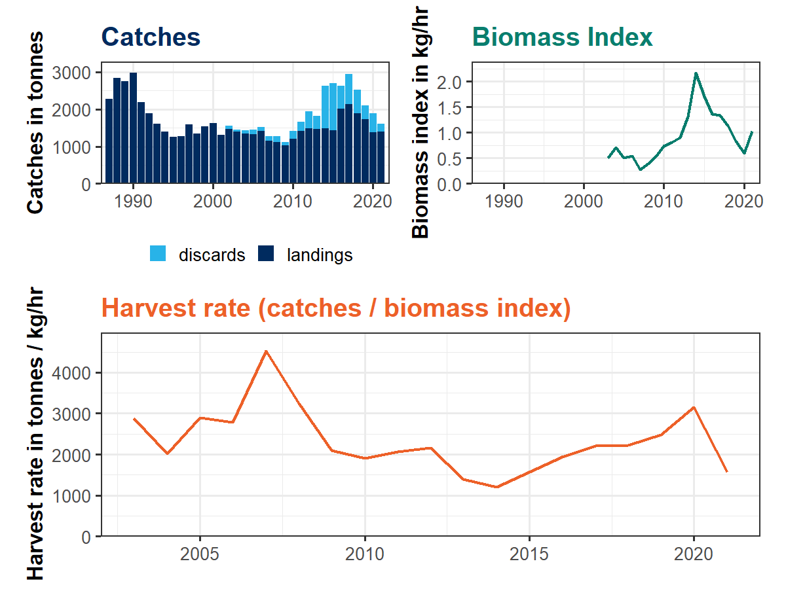

cat3advice
================
Simon H. Fischer
01 April, 2025

- [`cat3advice`](#cat3advice)
  - [Vignette change log](#vignette-change-log)
- [cat3advice R package](#cat3advice-r-package)
- [Documentation](#documentation)
- [Installation](#installation)
- [Tutorial](#tutorial)
- [The rfb rule](#the-rfb-rule)
  - [Reference catch $A_y$](#reference-catch-a_y)
  - [Biomass index trend (ratio) $r$](#biomass-index-trend-ratio-r)
  - [Biomass safeguard $b$](#biomass-safeguard-b)
  - [Fishing pressure proxy $f$](#fishing-pressure-proxy-f)
  - [Multiplier $m$](#multiplier-m)
  - [Application of rfb rule](#application-of-rfb-rule)
- [The rb rule](#the-rb-rule)
  - [Reference catch $A_y$](#reference-catch-a_y-1)
  - [Biomass index trend (ratio) $r$](#biomass-index-trend-ratio-r-1)
  - [Biomass safeguard $b$](#biomass-safeguard-b-1)
  - [Multiplier $m$](#multiplier-m-1)
  - [Application of rb rule](#application-of-rb-rule)
- [The chr rule](#the-chr-rule)
  - [Reference catch $A_y$](#reference-catch-a_y-2)
  - [Biomass index value $I_{y-1}$](#biomass-index-value-i_y-1)
  - [Biomass safeguard $b$](#biomass-safeguard-b-2)
  - [Target harvest rate
    $HR_{\text{MSYproxy}}$](#target-harvest-rate-hr_textmsyproxy)
  - [Multiplier $m$](#multiplier-m-2)
  - [Application of chr rule](#application-of-chr-rule)
- [chr rule with custom parameters and discard
  survival](#chr-rule-with-custom-parameters-and-discard-survival)
  - [Data](#data)
  - [Reference catch $A_y$](#reference-catch-a_y-3)
  - [Biomass index value](#biomass-index-value)
  - [Target harvest rate](#target-harvest-rate)
  - [Biomass safeguard](#biomass-safeguard)
  - [Multiplier](#multiplier)
  - [Application of the (tuned) chr
    rule](#application-of-the-tuned-chr-rule)
- [References](#references)

# `cat3advice`

## Vignette change log

<table style="width:98%;">
<colgroup>
<col style="width: 7%" />
<col style="width: 18%" />
<col style="width: 10%" />
<col style="width: 62%" />
</colgroup>
<thead>
<tr class="header">
<th>Version</th>
<th><code>cat3advice</code> version</th>
<th>Date</th>
<th>Changes</th>
</tr>
</thead>
<tbody>
<tr class="odd">
<td>1</td>
<td>0.0.7</td>
<td>2023</td>
<td></td>
</tr>
<tr class="even">
<td>2</td>
<td>0.1</td>
<td>2025-04-01</td>
<td><p>Updated vignette to latest changes in packages;</p>
<p>Added example of chr rule with tuned control parameters and discard
survival</p></td>
</tr>
</tbody>
</table>

# cat3advice R package

`cat3advice` is an R package that allows the application of the ICES
category 3 data-limited harvest control rules (rfb/rb/chr rules) and
follows the ICES Technical Guidelines (ICES 2025b)
(<https://doi.org/10.17895/ices.pub.28506179>).

# Documentation

The package documentation contains help files for its functions which
also include code examples. See `help(package = "cat3advice")` for
available functions.

The main functions are `rfb()`, `rb()`, and `chr()`. Each of these
functions has a help file with code examples (see `?rfb`, `?rb` `?chr`).

# Installation

The easiest way to install the `cat3advice` package is to install it as
a binary package from ICES r-universe:

``` r
install.packages("cat3advice", repos = c("https://ices-tools-prod.r-universe.dev", "https://cran.r-project.org"))
```

It is also possible to install it directly from the GitHub repository.
However, this means building the package locally and requires the
necessary build tools (e.g. on Windows RTools
<https://cran.r-project.org/bin/windows/Rtools/> and the `devtools` R
package).

``` r
library(remotes)
install_github("shfischer/cat3advice")
```

# Tutorial

This tutorial uses data from the ICES Western English Channel plaice
stock (ple.27.7e) to illustrate the application of the rfb/rb/chr rules.
The data are included in the `cat3advice` R package.

Before reading this vignette, please first read the ICES Technical
Guidelines (ICES 2025b).

For more details on the rfb rule, please refer to Fischer et al. (2020;
2021b, 2021a, 2023) and for the chr rule, please refer to Fischer et al.
(2022, 2023).

``` r
### load package
library(cat3advice)
```

# The rfb rule

The rfb rule is an index adjusted harvest control rule that uses a
biomass index and catch length data. The method is defined as Method 2.1
in the ICES Technical Guidelines (ICES 2025b) as

$$
A_{y+1} = A_y \times r \times f \times b \times m
$$

where $A_{y+1}$ is the new catch advice, $A_y$ the previous advice, $r$
the biomass ratio from a biomass index, $f$ the fishing pressure proxy
from catch length data, $b$ a biomass safeguard and $m$ a precautionary
multiplier. Furthermore, the change in the advice is restricted by a
stability clause that only allows changes of between $+20\%$ and $-30\%$
relative to the previous advice, but the application of the stability
clause is conditional on $b=1$ and turned off when $b<1$.

The rfb rule should be applied biennially, i.e. the catch advice is
valid for two years.

Please note that any change from the default configuration should be
supported by case-specific simulations.

## Reference catch $A_y$

The reference catch $A_y$ is usually the most recently advised catch. In
a typical ICES setting, an assessment is conducted in an assessment
(intermediate) year $y$ to give advice for the following advice year
$y+1$, this is the advice for year $y$:

``` r
### load plaice catch and advice data
data("ple7e_catch")
tail(ple7e_catch)
#>    year advice landings discards catch
#> 31 2017   2714     2128      821  2949
#> 32 2018   3257     1880      633  2513
#> 33 2019   3648     1725      366  2091
#> 34 2020   2721     1373      514  1888
#> 35 2021   2177     1403      211  1615
#> 36 2022   1742       NA       NA    NA
### get reference catch
A <- A(ple7e_catch, units = "tonnes")
A
#> An object of class "A".
#> Value: 1742
```

The ICES Technical Guidelines (ICES 2025b) specify that if the realised
catch is very different from the advised catch, the reference catch
could be replaced by an average of recent catches:

``` r
### use 3-year average
A(ple7e_catch, units = "tonnes", basis = "average catch", avg_years = 3)
#> An object of class "A".
#> Value: 1864.66666666667
```

The reference catch can also be defined manually:

``` r
### define manually
A(2000, units = "tonnes")
#> An object of class "A".
#> Value: 2000
```

## Biomass index trend (ratio) $r$

The biomass index trend $r$ calculates the trend in the biomass index
over last the five years, by dividing the mean of the last two years by
the mean of the three preceding years:

$$
r = \Sigma_{i=y-2}^{y-1}(I_i/2)\ / \ \Sigma_{i=y-5}^{y-3}(I_i/3)
$$

The ratio is calculated with the function `r`. Index data should be
provided as a `data.frame` with columns `year` and `index`.

``` r
### load plaice data
data("ple7e_idx")
tail(ple7e_idx)
#>    year     index
#> 14 2016 1.3579990
#> 15 2017 1.3323659
#> 16 2018 1.1327596
#> 17 2019 0.8407277
#> 18 2020 0.5996326
#> 19 2021 1.0284297

### calculate biomass trend
r <- r(ple7e_idx, units = "kg/hr")
r
#> An object of class "rfb_r".
#> Value: 0.73871806243358

### ICES advice style table
advice(r)
#> --------------------------------------------------------------------------------
#> Stock biomass trend
#> --------------------------------------------------------------------------------
#> Index A (2020,2021)                              |                    0.81 kg/hr
#> Index B (2017,2018,2019)                         |                    1.10 kg/hr
#> r: multiplier for stock biomass trend            |                          0.74
#>    (index ratio A/B)                             |

### plot index
### horizontal orange lines correspond to the the 2/3-year averages
plot(r)
```


``` r

### when the value of r is known
r(1)
#> An object of class "r".
#> Value: 1
```

Biomass index data are usually available until the year before the
advice year. More recent data can be used and the function automatically
picks the most recent data provided to it.

## Biomass safeguard $b$

The biomass safeguard reduces the advice when the biomass index $I$
falls below a threshold value $I_{\text{trigger}}$:

$$
b = \text{min}\{1,\ I_{y-1}/I_{\text{trigger}}\}
$$ By default, the trigger value is defined based on the lowest observed
index value $I_{\text{loss}}$ as
$I_{\text{trigger}} = 1.4I_{\text{loss}}$.

The biomass safeguard is calculated with the function `b`:

``` r
### use same plaice data as before
### application in first year with new calculation of Itrigger
b <- b(ple7e_idx, units = "kg/hr")
b
#> An object of class "b".
#> Value: 1

### ICES advice style table
advice(b)
#> --------------------------------------------------------------------------------
#> Biomass safeguard
#> --------------------------------------------------------------------------------
#> Index trigger value (Itrigger = Iloss x 1.4)     |                    0.39 kg/hr
#> b: multiplier for index relative to trigger,     |                          1.00
#>    min{I2021/Itrigger, 1}                        |

### plot
plot(b)
```


``` r
### plot b and r in one figure
plot(r, b)
```


**Please note that** $I_{\text{trigger}}$ should only be defined once in
the first year of the application of the rfb rule. In the following
years, the same value should be used. For this purpose, `b` allows the
direct definition of $I_{\text{trigger}}$, or, more conveniently,
$I_{\text{trigger}}$ can be based on the year in which $I_{\text{loss}}$
is defined:

``` r
### in following years, Itrigger should NOT be updated
### i.e. provide value for Itrigger
b(ple7e_idx, units = "kg/hr", Itrigger = 0.3924721)
#> An object of class "b".
#> Value: 1
### alternatively, the reference year for Iloss can be used
b(ple7e_idx, units = "kg/hr", yr_ref = 2007)
#> An object of class "b".
#> Value: 1
```

## Fishing pressure proxy $f$

Catch length data are used to approximate the fishing pressure. The mean
length of fish in the catch compared to a reference length is used as
the indicator.

### Length data

The fishing pressure proxy requires length data from the catch. Ideally,
length data for several years are provided in a `data.frame` with
columns `year`, `length` and `numbers`. An additional column
`catch_category` specifying the catch category, such as discards and
landings, is optional.

``` r
data("ple7e_length")
head(ple7e_length)
#>   year             catch_category length numbers
#> 1 2018                BMS landing    100    0.00
#> 2 2018                   Discards    100 5887.55
#> 3 2018 Logbook Registered Discard    100    0.00
#> 4 2015                   Discards    120  128.60
#> 5 2016                BMS landing    140    0.00
#> 6 2018                BMS landing    140    0.00
```

### Length at first capture $L_c$

Only length data above the length at first capture $L_c$ are used to
avoid noisy data from fish that are not fully selected. $L_c$ is defined
as the first length class where the abundance is at or above 50% of the
mode of the length distribution and can be calculated with the function
`Lc()`:

``` r
lc <- Lc(ple7e_length)
lc
#> 2014 2015 2016 2017 2018 2019 2020 2021 
#>  240  260  260  270  260  260  260  270
plot(lc)
```


$L_c$ can change from year to year. Therefore, it is recommended to pool
data from several (e.g. 5) years:

``` r
lc <- Lc(ple7e_length, pool = 2017:2021)
lc
#> [1] 260
plot(lc)
```


If length data are noisy, the size of the length classes can be
increased:

``` r
### use 20mm length classes
plot(Lc(ple7e_length, pool = 2017:2021, lstep = 20))
```


Once defined, $L_c$ should be kept constant and the same value used for
all data years. $L_c$ should only be changed if there are strong changes
in the fishery or data.

### Mean length

After defining $L_c$, the mean (annual) catch length $L_{\text{mean}}$
above $L_c$ can be calculated:

``` r
### calculate annual mean length
lmean <- Lmean(data = ple7e_length, Lc = lc, units = "mm")
lmean
#>     2014     2015     2016     2017     2018     2019     2020     2021 
#> 310.6955 322.8089 333.1876 326.9434 326.5741 339.8752 321.5979 319.1974
plot(lmean)
```


If length data are noisy, the size of the length classes can be
increased:

``` r
### use 20mm length classes
plot(Lmean(data = ple7e_length, Lc = lc, units = "mm", lstep = 20))
```


### Reference length

The reference length follows the concepts of Beverton and Holt (1957)
and is calculated as derived by Jardim, Azevedo, and Brites (2015):

$$
L_{F=M} = 0.75L_c + 0.25L_\infty
$$ where $L_{F=M}$ is the MSY reference length, $L_c$ the length at
first capture as defined above, and $L_\infty$ the von Bertalanffy
asymptotic length. This simple equation assumes that fishing at $F=M$
can be used as a proxy for MSY and that $M/k=1.5$ (where $M$ is the
natural mortality and $k$ the von Bertalanffy individual growth rate).
The reference length can be calculated with

``` r
lref <- Lref(Lc = 264, Linf = 585, units = "mm")
lref
#> [1] 344.25
```

The reference length $L_{F=M}$ should only be defined once in the first
year of the application of the rfb rule. In the following years, the
same value should be used.

Deviations from the assumptions of $F=M$ and $M/k=1.5$ are possible
following Equation A.3 of Jardim, Azevedo, and Brites (2015)
$L_{F=\gamma M, k = \theta M}=(\theta L_\infty + L_c(\gamma + 1))/(\theta + \gamma +1)$
and can be used by providing arguments `gamma` and `theta` to `Lref()`.

### Indicator

The length indicator $f$ is defined as

$$
f = L_{\text{mean}}/L_{F=M}
$$

and can be calculated with `f()`:

``` r
f <- f(Lmean = lmean, Lref = lref, units = "mm")
f
#> An object of class "f".
#> Value: 0.927225455656142
### ICES advice style table
advice(f)
#> --------------------------------------------------------------------------------
#> Fishing pressure
#> --------------------------------------------------------------------------------
#> Mean catch length (Lmean = L2021)                |                        319 mm
#> MSY proxy length (LF=M)                          |                        344 mm
#> Fishing pressure proxy (LF=M/Lmean)              |                          1.08
#> f: multiplier for relative mean length in catches|                          0.93
#>    (L2021/LF=M)                                  |
### plot
plot(f)
```


In this case, the mean catch length (orange curve) is always below the
MSY proxy reference length (blue horizontal line), indicating that the
fishing pressure was above $F_{\text{MSY}}$.

## Multiplier $m$

The multiplier $m$ is a tuning parameter and ensures that the catch
advice is precautionary in the long term.

The value of $m$ is set depending on the von Bertalanffy parameter $k$
(individual growth rate), with $m=0.95$ for stocks with
$k<0.2/\text{year}$ and $m=0.90$ for stocks with
$0.2\text{year}^{-1} \leq k < 0.32\text{year}^{-1}$. The multiplier can
be calculated with the function `m()`:

``` r
# for k=0.1/year
m <- m(hcr = "rfb", k = 0.1)
#> Multiplier (m) for the rfb rule: selecting value based on k: m=0.95
m
#> An object of class "m".
#> Value: 0.95

### alias for rfb rule
rfb_m(k = 0.1)
#> Multiplier (m) for the rfb rule: selecting value based on k: m=0.95
#> An object of class "rfb_m".
#> Value: 0.95

### ICES advice style table
advice(m)
#> --------------------------------------------------------------------------------
#> Precautionary multiplier to maintain biomass above Blim with 95% probability
#> --------------------------------------------------------------------------------
#> m: multiplier                                    |                          0.95
#>    (generic multiplier based on life history)    |
```

Please note that the multiplier $m$ does not lead to a continuous
reduction in the catch advice. The components of the rfb rule are
multiplicative, this means that $m$ could be considered as part of
component $f$ and essentially adjusts the reference length $L_{F=M}$ to
$L'_{F=M}$:

$$
A_{y+1} = A_y\ r\ f\ b\ m = A_y\ r\ \frac{L_{\text{mean}}}{L_{F=M}}\ b\ m = A_y\ r\ \frac{L_{\text{mean}}}{L_{F=M}/m}\ b = A_y\ r\ \frac{L_{\text{mean}}}{L'_{F=M}}\ b
$$

## Application of rfb rule

Now we have all the components of the rfb rule and can apply it:

``` r
advice <- rfb(A = A, r = r, f = f, b = b, m = m, discard_rate = 27)
advice
#> An object of class "rfb".
#> Value: 1219.4
```

A discard rate in % can be provided to the argument `discard_rate` and
this means the advice is provided for the catch and landings.

The rfb rule includes a stability clause that restricts changes to
$+20\%$ and $-30\%$. This stability clause is conditional on the biomass
safeguard and is only applied if $b=1$ but turned off when $b<1$.

`cat3advice` can print a table similar to the table presented in ICES
advice sheets in which all numbers are rounded following ICES rounding
rules:

``` r
advice(advice)
#> --------------------------------------------------------------------------------
#> Previous catch advice Ay (advised catch for 2022) |                   1742 tonnes
#> --------------------------------------------------------------------------------
#> Stock biomass trend
#> --------------------------------------------------------------------------------
#> Index A (2020,2021)                              |                    0.81 kg/hr
#> Index B (2017,2018,2019)                         |                    1.10 kg/hr
#> r: multiplier for stock biomass trend            |                          0.74
#>    (index ratio A/B)                             | 
#> --------------------------------------------------------------------------------
#> Fishing pressure
#> --------------------------------------------------------------------------------
#> Mean catch length (Lmean = L2021)                |                        319 mm
#> MSY proxy length (LF=M)                          |                        344 mm
#> Fishing pressure proxy (LF=M/Lmean)              |                          1.08
#> f: multiplier for relative mean length in catches|                          0.93
#>    (L2021/LF=M)                                  | 
#> --------------------------------------------------------------------------------
#> Biomass safeguard
#> --------------------------------------------------------------------------------
#> Index trigger value (Itrigger = Iloss x 1.4)     |                    0.39 kg/hr
#> b: multiplier for index relative to trigger,     |                          1.00
#>    min{I2021/Itrigger, 1}                        |                              
#> --------------------------------------------------------------------------------
#> Precautionary multiplier to maintain biomass above Blim with 95% probability
#> --------------------------------------------------------------------------------
#> m: multiplier                                    |                          0.95
#>    (generic multiplier based on life history)    |                              
#> RFB calculation (Ay*r*f*b*m)                     |                   1134 tonnes
#> Stability clause (+20%/-30% compared to Ay,      | 
#>    only applied if b=1)                          |       Applied |           0.7
#> Catch advice for 2023 and 2024                   | 
#>    (Ay * stability clause)                       |                   1219 tonnes
#> Discard rate                                     |                           27%
#> Projected landings corresponding to advice       |                    890 tonnes
#> % advice change                                  |                          -30%
```

# The rb rule

The rb rule is essentially a simplified version of the rfb rule without
component f, i.e. applicable to stocks without reliable catch length
data. This method is meant as a last resort and should be avoid if
possible.

The rb rule is an index adjusted harvest control rule that adjusts the
catch advice based on a biomass index but does not have a target. The
method is defined as Method 2.3 in the ICES Technical Guidelines (ICES
2025b) as

$$
A_{y+1} = A_y \times r \times b \times m
$$

where $A_{y+1}$ is the new catch advice, $A_y$ the previous advice, $r$
the biomass ratio from a biomass index, $b$ a biomass safeguard and $m$
a precautionary multiplier. Furthermore, the change in the advice is
restricted by a stability clause that only allows changes of between
$+20\%$ and $-30\%$ relative to the previous advice, but the application
of the stability clause is conditional on $b=1$ and turned off when
$b<1$.

The rb rule should be applied biennially, i.e. the catch advice is valid
for two years.

Please note that any change from the default configuration should be
supported by case-specific simulations.

## Reference catch $A_y$

The reference catch $A_y$ is usually the most recently advised catch. In
a typical ICES setting, an assessment is conducted in an assessment
(intermediate) year $y$ to give advice for the following advice year
$y+1$, this is the advice for year $y$:

``` r
### load plaice catch and advice data
data("ple7e_catch")
tail(ple7e_catch)
#>    year advice landings discards catch
#> 31 2017   2714     2128      821  2949
#> 32 2018   3257     1880      633  2513
#> 33 2019   3648     1725      366  2091
#> 34 2020   2721     1373      514  1888
#> 35 2021   2177     1403      211  1615
#> 36 2022   1742       NA       NA    NA
### get reference catch
A <- A(ple7e_catch, units = "tonnes")
A
#> An object of class "A".
#> Value: 1742
```

The ICES Technical Guidelines (ICES 2025b) specify that if the realised
catch is very different from the advised catch, the reference catch
could be replaced by an average of recent catches:

``` r
### use 3-year average
A(ple7e_catch, units = "tonnes", basis = "average catch", avg_years = 3)
#> An object of class "A".
#> Value: 1864.66666666667
```

The reference catch can also be defined manually:

``` r
### use 3-year average
A(2000, units = "tonnes")
#> An object of class "A".
#> Value: 2000
```

## Biomass index trend (ratio) $r$

The biomass index trend $r$ calculates the trend in the biomass index
over last the five years, by dividing the mean of the last two years by
the mean of the three preceding years:

$$
r = \Sigma_{i=y-2}^{y-1}(I_i/2)\ / \ \Sigma_{i=y-5}^{y-3}(I_i/3)
$$

The ratio is calculated with the function `r`. Index data should be
provided as a `data.frame` with columns `year` and `index`.

``` r
### load plaice data
data("ple7e_idx")
tail(ple7e_idx)
#>    year     index
#> 14 2016 1.3579990
#> 15 2017 1.3323659
#> 16 2018 1.1327596
#> 17 2019 0.8407277
#> 18 2020 0.5996326
#> 19 2021 1.0284297

### calculate biomass trend
r <- r(ple7e_idx, units = "kg/hr")
r
#> An object of class "rfb_r".
#> Value: 0.73871806243358

### ICES advice style table
advice(r)
#> --------------------------------------------------------------------------------
#> Stock biomass trend
#> --------------------------------------------------------------------------------
#> Index A (2020,2021)                              |                    0.81 kg/hr
#> Index B (2017,2018,2019)                         |                    1.10 kg/hr
#> r: multiplier for stock biomass trend            |                          0.74
#>    (index ratio A/B)                             |

### plot index
### horizontal orange lines correspond to the the 2/3-year averages
plot(r)
```


``` r

### when the value of r is known
r(1)
#> An object of class "r".
#> Value: 1
```

Biomass index data are usually available until the year before the
advice year. More recent data can be used and the function automatically
picks the most recent data provided to it.

## Biomass safeguard $b$

The biomass safeguard reduces the advice when the biomass index $I$
falls below a threshold value $I_{\text{trigger}}$:

$$
b = \text{min}\{1,\ I_{y-1}/I_{\text{trigger}}\}
$$ By default, the trigger value is defined based on the lowest observed
index value $I_{\text{loss}}$ as
$I_{\text{trigger}} = 1.4I_{\text{loss}}$.

The biomass safeguard is calculated with the function `b`:

``` r
### use same plaice data as before
### application in first year with new calculation of Itrigger
b <- b(ple7e_idx, units = "kg/hr")
b
#> An object of class "b".
#> Value: 1

### ICES advice style table
advice(b)
#> --------------------------------------------------------------------------------
#> Biomass safeguard
#> --------------------------------------------------------------------------------
#> Index trigger value (Itrigger = Iloss x 1.4)     |                    0.39 kg/hr
#> b: multiplier for index relative to trigger,     |                          1.00
#>    min{I2021/Itrigger, 1}                        |

### plot
plot(b)
```


``` r
### plot b and r in one figure
plot(r, b)
```


**Please note that** $I_{\text{trigger}}$ should only be defined once in
the first year of the application of the rb rule. In the following
years, the same value should be used. For this purpose, `b` allows the
direct definition of $I_{\text{trigger}}$, or, more conveniently,
$I_{\text{trigger}}$ can be based on the year in which $I_{\text{loss}}$
is defined:

``` r
### in following years, Itrigger should NOT be updated
### i.e. provide value for Itrigger
b(ple7e_idx, units = "kg/hr", Itrigger = 0.3924721)
#> An object of class "b".
#> Value: 1
### alternatively, the reference year for Iloss can be used
b(ple7e_idx, units = "kg/hr", yr_ref = 2007)
#> An object of class "b".
#> Value: 1
```

## Multiplier $m$

The multiplier $m$ is a tuning parameter and ensures that the catch
advice is precautionary in the long term.

The value of $m$ is set to $m=0.5$ for all stocks. The multiplier can be
calculated with the function `m()`:

``` r
m <- m(hcr = "rb")
m
#> An object of class "m".
#> Value: 0.5

### alias for rb rule
rb_m()
#> An object of class "rb_m".
#> Value: 0.5

### ICES advice style table
advice(m)
#> --------------------------------------------------------------------------------
#> Precautionary multiplier to maintain biomass above Blim with 95% probability
#> --------------------------------------------------------------------------------
#> m: multiplier                                    |                          0.50
#>    (generic multiplier based on life history)    |
```

Please note that for the rb rule, the multiplier $m$ does lead to a
continuous reduction in the catch advice because the rb rule does not
include a target.

## Application of rb rule

Now we have all the components of the rb rule and can apply it:

``` r
advice <- rb(A = A, r = r, b = b, m = m, discard_rate = 27)
advice
#> An object of class "rb".
#> Value: 1219.4
```

A discard rate in % can be provided to the argument `discard_rate` and
this means the advice is provided for the catch and landings.

The rb rule includes a stability clause that restricts changes to $+20%$
and $-30%$. This stability clause is conditional on the biomass
safeguard and is only applied if $b=1$ but turned off when $b<1$.

`cat3advice` can print a table similar to the table presented in ICES
advice sheets in which all numbers are rounded following ICES rounding
rules:

``` r
advice(advice)
#> --------------------------------------------------------------------------------
#> Previous catch advice Ay (advised catch for 2022) |                   1742 tonnes
#> --------------------------------------------------------------------------------
#> Stock biomass trend
#> --------------------------------------------------------------------------------
#> Index A (2020,2021)                              |                    0.81 kg/hr
#> Index B (2017,2018,2019)                         |                    1.10 kg/hr
#> r: multiplier for stock biomass trend            |                          0.74
#>    (index ratio A/B)                             | 
#> --------------------------------------------------------------------------------
#> Biomass safeguard
#> --------------------------------------------------------------------------------
#> Index trigger value (Itrigger = Iloss x 1.4)     |                    0.39 kg/hr
#> b: multiplier for index relative to trigger,     |                          1.00
#>    min{I2021/Itrigger, 1}                        |                              
#> --------------------------------------------------------------------------------
#> Precautionary multiplier to maintain biomass above Blim with 95% probability
#> --------------------------------------------------------------------------------
#> m: multiplier                                    |                          0.50
#>    (generic multiplier based on life history)    |                              
#> RB calculation (r*b*m)                           |                    643 tonnes
#> Stability clause (+20%/-30% compared to Ay,      | 
#>    only applied if b=1)                          |       Applied |           0.7
#> Catch advice for 2023 and 2024                   | 
#>    (Ay * stability clause)                       |                   1219 tonnes
#> Discard rate                                     |                           27%
#> Projected landings corresponding to advice       |                    890 tonnes
#> % advice change                                  |                          -30%
```

# The chr rule

The chr rule is a (relative) harvest rate-based harvest control rule.
The relative harvest rate is defined by dividing the catch by the values
from a biomass index. It is not an absolute harvest rate because the
absolute stock size is unknown. The method is defined as Method 2.2 in
the ICES Technical Guidelines (ICES 2025b) as

$$
A_{y+1} = I_{y-1} \times F_{\text{proxyMSY}} \times b \times m
$$

where $A_{y+1}$ is the new catch advice, $I_{y-1}$ the last biomass
index value, $F_{\text{proxyMSY}}$ the (relative) harvest rate target,
$b$ a biomass safeguard and $m$ a precautionary multiplier. Furthermore,
the change in the advice is restricted by a stability clause that only
allows changes of between $+20\%$ and $-30\%$ relative to the previous
advice, but the application of the stability clause is conditional on
$b=1$ and turned off when $b<1$.

The chr rule should be applied annually, i.e. the catch advice is valid
for one year.

Please note that any change from the default configuration should be
supported by case-specific simulations.

## Reference catch $A_y$

A reference catch $A_y$ is needed for the application of the stability
clause. The reference catch $A_y$ is usually the most recently advised
catch. In a typical ICES setting, an assessment is conducted in an
assessment (intermediate) year $y$ to give advice for the following
advice year $y+1$, this is the advice for year $y$:

``` r
### load plaice catch and advice data
data("ple7e_catch")
tail(ple7e_catch)
#>    year advice landings discards catch
#> 31 2017   2714     2128      821  2949
#> 32 2018   3257     1880      633  2513
#> 33 2019   3648     1725      366  2091
#> 34 2020   2721     1373      514  1888
#> 35 2021   2177     1403      211  1615
#> 36 2022   1742       NA       NA    NA
### get reference catch
A <- A(ple7e_catch, units = "tonnes")
A
#> An object of class "A".
#> Value: 1742
```

The ICES Technical Guidelines (ICES 2025b) specify that if the realised
catch is very different from the advised catch, the reference catch
could be replaced by an average of recent catches:

``` r
### use 3-year average
A(ple7e_catch, units = "tonnes", basis = "average catch", avg_years = 3)
#> An object of class "A".
#> Value: 1864.66666666667
```

The reference catch can also be defined manually:

``` r
### use 3-year average
A(2000, units = "tonnes")
#> An object of class "A".
#> Value: 2000
```

## Biomass index value $I_{y-1}$

$I_{y-1}$ is the most recent value from the biomass index. This is
usually a value from the year before the assessment year ($y$) but a
more recent value can be used if available.

Index data should be provided as a `data.frame` with columns `year` and
`index`.

``` r
### load plaice data
data("ple7e_idx")
tail(ple7e_idx)
#>    year     index
#> 14 2016 1.3579990
#> 15 2017 1.3323659
#> 16 2018 1.1327596
#> 17 2019 0.8407277
#> 18 2020 0.5996326
#> 19 2021 1.0284297

### get most recent value
i <- I(ple7e_idx, units = "kg/hr")
i
#> An object of class "I".
#> Value: 1.028429723

### ICES advice style table
advice(i)
#> --------------------------------------------------------------------------------
#> Biomass index
#> --------------------------------------------------------------------------------
#> I: most recent biomass index (I2021)             |                    1.03 kg/hr

### plot index
plot(i)
```


``` r

### when the value of I is known
I(1)
#> An object of class "I".
#> Value: 1
```

## Biomass safeguard $b$

The biomass safeguard reduces the advice when the biomass index $I$
falls below a threshold value $I_{\text{trigger}}$:

$$
b = \text{min}\{1,\ I_{y-1}/I_{\text{trigger}}\}
$$ By default, the trigger value is defined based on the lowest observed
index value $I_{\text{loss}}$ as
$I_{\text{trigger}} = 1.4I_{\text{loss}}$.

The biomass safeguard is calculated with the function `b`:

``` r
### use same plaice data as before
### application in first year with new calculation of Itrigger
b <- b(ple7e_idx, units = "kg/hr")
b
#> An object of class "b".
#> Value: 1

### ICES advice style table
advice(b)
#> --------------------------------------------------------------------------------
#> Biomass safeguard
#> --------------------------------------------------------------------------------
#> Index trigger value (Itrigger = Iloss x 1.4)     |                    0.39 kg/hr
#> b: multiplier for index relative to trigger,     |                          1.00
#>    min{I2021/Itrigger, 1}                        |

### plot
plot(b)
```


**Please note that** $I_{\text{trigger}}$ should only be defined once in
the first year of the application of the chr rule. In the following
years, the same value should be used. For this purpose, `b` allows the
direct definition of $I_{\text{trigger}}$, or, more conveniently,
$I_{\text{trigger}}$ can be based on the year in which $I_{\text{loss}}$
is defined:

``` r
### in following years, Itrigger should NOT be updated
### i.e. provide value for Itrigger
b(ple7e_idx, units = "kg/hr", Itrigger = 0.3924721)
#> An object of class "b".
#> Value: 1
### alternatively, the reference year for Iloss can be used
b(ple7e_idx, units = "kg/hr", yr_ref = 2007)
#> An object of class "b".
#> Value: 1
```

## Target harvest rate $HR_{\text{MSYproxy}}$

The target harvest rate $HR_{\text{MSYproxy}}$ defines the target for
the chr rule and is a proxy for MSY. The standard approach to define
$HR_{\text{MSYproxy}}$ is to use catch length data, find years in which
the mean catch length $L_{\text{mean}}$ is above a reference length
($L_{F=M}$), calculate the harvest rate for these years, and use their
average. The approach is the same as the one used for component $f$ of
the rfb rule described above. This needs to be done only once in the
first year of the application of the chr rule. In subsequent years, no
length data are required.

### Length data

Ideally, length data for several years are provided in a `data.frame`
with columns `year`, `length` and `numbers`. An additional column
`catch_category` specifying the catch category, such as discards and
landings, is optional.

``` r
data("ple7e_length")
head(ple7e_length)
#>   year             catch_category length numbers
#> 1 2018                BMS landing    100    0.00
#> 2 2018                   Discards    100 5887.55
#> 3 2018 Logbook Registered Discard    100    0.00
#> 4 2015                   Discards    120  128.60
#> 5 2016                BMS landing    140    0.00
#> 6 2018                BMS landing    140    0.00
```

### Length at first capture $L_c$

Only length data above the length at first capture $L_c$ are used to
avoid noisy data from fish that are not fully selected. $L_c$ is defined
as the first length class where the abundance is at or above 50% of the
mode of the length distribution and can be calculated with the function
`Lc()`:

``` r
lc <- Lc(ple7e_length)
lc
#> 2014 2015 2016 2017 2018 2019 2020 2021 
#>  240  260  260  270  260  260  260  270
plot(lc)
```


$L_c$ can change from year to year. Therefore, it is recommended to pool
data from several (e.g. 5) years:

``` r
lc <- Lc(ple7e_length, pool = 2017:2021)
lc
#> [1] 260
plot(lc)
```


If length data are noisy, the size of the length classes can be
increased:

``` r
### use 20mm length classes
plot(Lc(ple7e_length, pool = 2017:2021, lstep = 20))
```


Once defined, $L_c$ should be kept constant and the same value used for
all data years. $L_c$ should only be changed if there are strong changes
in the fishery or data.

### Mean length

After defining $L_c$, the mean (annual) catch length $L_{\text{mean}}$
above $L_c$ can be calculated:

``` r
### calculate annual mean length
lmean <- Lmean(data = ple7e_length, Lc = lc, units = "mm")
lmean
#>     2014     2015     2016     2017     2018     2019     2020     2021 
#> 310.6955 322.8089 333.1876 326.9434 326.5741 339.8752 321.5979 319.1974
plot(lmean)
```


If length data are noisy, the size of the length classes can be
increased:

``` r
### use 20mm length classes
plot(Lmean(data = ple7e_length, Lc = lc, units = "mm", lstep = 20))
```


### Reference length

The reference length follows the concepts of Beverton and Holt (1957)
and is calculated as derived by Jardim, Azevedo, and Brites (2015):

$$
L_{F=M} = 0.75L_c + 0.25L_\infty
$$ where $L_{F=M}$ is the MSY reference length, $L_c$ the length at
first capture as defined above, and $L_\infty$ the von Bertalanffy
asymptotic length. This simple equation assumes that fishing at $F=M$
can be used as a proxy for MSY and that $M/k=1.5$ (where $M$ is the
natural mortality and $k$ the von Bertalanffy individual growth rate).
The reference length can be calculated with

``` r
lref <- Lref(Lc = 264, Linf = 585, units = "mm")
lref
#> [1] 344.25
### use a dummy value here for illustrative purposes of the chr rule
lref <- Lref(330, units = "mm")
```

Deviations from the assumptions of $F=M$ and $M/k=1.5$ are possible
following Equation A.3 of Jardim, Azevedo, and Brites (2015)
$L_{F=\gamma M, k = \theta M}=(\theta L_\infty + L_c(\gamma + 1))/(\theta + \gamma +1)$
and can be used by providing arguments `gamma` and `theta` to `Lref()`.

### Indicator

The mean catch length relative to the reference
$f = L_{\text{mean}}/L_{F=M}$ is used as an indicator. The same function
(`f()`) as used in the rfb rule (described above) can be used to
calculate the indicator time series:

``` r
f <- f(Lmean = lmean, Lref = lref, units = "mm")
plot(f)
```


In this case, the mean catch length (orange curve) is above the
reference length in two years, indicating that the fishing pressure was
below $F_{\text{MSY}}$ in these two years.

ICES advice sheets typically show the inverse indicator ratio. This can
be plotted by adding an `inverse = TRUE` argument to `plot()`:

``` r
plot(f, inverse = TRUE)
```


The time series of the indicator values can be printed with

``` r
indicator(f)
#> # A tibble: 8 × 6
#> # Groups:   year, Lc [8]
#>    year    Lc Lmean  Lref indicator inverse_indicator
#>   <int> <int> <dbl> <dbl>     <dbl>             <dbl>
#> 1  2014   260  311.   330     0.942             1.06 
#> 2  2015   260  323.   330     0.978             1.02 
#> 3  2016   260  333.   330     1.01              0.990
#> 4  2017   260  327.   330     0.991             1.01 
#> 5  2018   260  327.   330     0.990             1.01 
#> 6  2019   260  340.   330     1.03              0.971
#> 7  2020   260  322.   330     0.975             1.03 
#> 8  2021   260  319.   330     0.967             1.03
```

and the inverse values also with

``` r
inverse_indicator(f)
#> # A tibble: 8 × 2
#> # Groups:   year [8]
#>    year inverse_indicator
#>   <int>             <dbl>
#> 1  2014             1.06 
#> 2  2015             1.02 
#> 3  2016             0.990
#> 4  2017             1.01 
#> 5  2018             1.01 
#> 6  2019             0.971
#> 7  2020             1.03 
#> 8  2021             1.03
```

### Harvest rate

For the estimation of the target harvest rate, the harvest rate needs to
be calculated with `HR()`.

``` r
### catch data
data("ple7e_catch")
### index data
data("ple7e_idx")

### combine catch and index data into single data.frame
df <- merge(ple7e_catch, ple7e_idx, all = TRUE) # combine catch & index data

### calculate harvest rate
hr <- HR(df, units_catch = "tonnes", units_index = "kg/hr")
hr
#> An object of class "HR".
#> Value(s) (based on catch): 
#>     2003     2004     2005     2006     2007     2008     2009     2010     2011     2012     2013     2014 
#> 2882.668 2023.556 2890.803 2779.141 4526.691 3242.396 2091.990 1903.229 2056.537 2161.624 1394.154 1204.222 
#>     2015     2016     2017     2018     2019     2020     2021 
#> 1575.161 1937.409 2213.356 2218.476 2487.131 3148.595 1570.355
```

The harvest rate can only be calculated for years in which both catch
and index data are available. The harvest rate and its input data can be
plotted automatically:

``` r
plot(hr)
```



### Harvest rate target $HR_{\text{MSYproxy}}$

Now we can use the indicator and (relative) harvest rate time series to
calculate the target harvest rate:

``` r
### calculate (relative) target harvest rate
HR <- F(hr, f) 
HR
#> An object of class "F".
#> Value: 2212.27020813614
plot(HR)
#> Warning: Removed 17 rows containing missing values or values outside the scale range (`geom_line()`).
```


The years selected for the target harvest rate are indicated by orange
points.

## Multiplier $m$

The multiplier $m$ is a tuning parameter and ensures that the catch
advice is precautionary in the long term.

By default, the value of $m$ is set to $m=0.5$. The multiplier can be
calculated with the function `m()`:

``` r
m <- m(hcr = "chr")
m
#> An object of class "m".
#> Value: 0.5

### alias for chr rule
chr_m()
#> An object of class "chr_m".
#> Value: 0.5

### ICES advice style table
advice(m)
#> --------------------------------------------------------------------------------
#> Precautionary multiplier to maintain biomass above Blim with 95% probability
#> --------------------------------------------------------------------------------
#> m: multiplier                                    |                          0.50
#>    (generic multiplier based on life history)    |
```

Please note that the multiplier $m$ does not lead to a continuous
reduction in the catch advice. The components of the chr rule are
multiplicative, this means that $m$ could be considered as adjusting the
target harvest rate $F_{\text{MSY}}$ to $F'_{\text{MSY}}$:

$$
A_{y+1} = I \times F_{\text{proxyMSY}} \times b \times m = I \times \frac{F_{\text{proxyMSY}}}{1/m} \times b = I \times F'_{\text{proxyMSY}} \times b
$$

## Application of chr rule

Now we have all the components of the chr rule and can apply it:

``` r
advice <- chr(A = A, I = i, F = HR, b = b, m = m, discard_rate = 27)
advice
#> An object of class "chr".
#> Value: 1219.4
```

A discard rate in % can be provided to the argument `discard_rate` and
this means the advice is provided for the catch and landings.

The chr rule includes a stability clause that restricts changes to
$+20\%$ and $-30\%$. This stability clause is conditional on the biomass
safeguard and is only applied if $b=1$ but turned off when $b<1$.

`cat3advice` can print a table similar to the table presented in ICES
advice sheets in which all numbers are rounded following ICES rounding
rules:

``` r
advice(advice)
#> --------------------------------------------------------------------------------
#> Biomass index
#> --------------------------------------------------------------------------------
#> I: most recent biomass index (I2021)             |                    1.03 kg/hr
#> --------------------------------------------------------------------------------
#> MSY proxy harvest rate
#> --------------------------------------------------------------------------------
#> HRMSYproxy: MSY proxy harvest rate (average of   | 
#>   the ratio of catch to biomass index for the    | 
#>   years for which f>1, where f=Lmean/LF=M)       |           2212 tonnes / kg/hr
#> --------------------------------------------------------------------------------
#> Biomass safeguard
#> --------------------------------------------------------------------------------
#> Index trigger value (Itrigger = Iloss x 1.4)     |                    0.39 kg/hr
#> b: multiplier for index relative to trigger,     |                          1.00
#>    min{I2021/Itrigger, 1}                        |                              
#> --------------------------------------------------------------------------------
#> Precautionary multiplier to maintain biomass above Blim with 95% probability
#> --------------------------------------------------------------------------------
#> m: multiplier                                    |                          0.50
#>    (generic multiplier based on life history)    |                              
#> --------------------------------------------------------------------------------
#> Catch advice calculations
#> --------------------------------------------------------------------------------
#> chr calculation (I*HR*b*m)                       |                   1138 tonnes
#> Ay: previous catch advice (advised catch for 2022) |                   1742 tonnes
#> Stability clause (+20%/-30%, chr calculation     | 
#>    compared to Ay, only applied if b=1)          |       Applied |           0.7
#> Discard rate                                     |                           27%
#> Catch advice for 2023                            |                  1219 tonnes
#>    (Ay * stability clause)                       | 
#> Landings corresponding to advice                 |                    890 tonnes
#> Discards corresponding to advice                 |                    329 tonnes
#> % advice change                                  |                             %
```

# chr rule with custom parameters and discard survival

The ICES plaice stock in the western English Channel was included in the
WKBPLAICE (ICES 2025a) benchmark in 2024. During this benchmark, a
stock-specific management strategy evaluation (MSE) was developed to
tune the chr rule. This means the control parameters of the chr rule for
this stock differ from the default values. Furthermore, discard survival
is also considered. This section of the vignette illustrates how the
advice can be calculated with the `cat3advice` R package for this
situation.

## Data

Example data is available in the `ple7e_WKBPLAICE` object:

``` r
data("ple7e_WKBPLAICE")
tail(ple7e_WKBPLAICE)
#>    year advice advice_landings advice_discards   catch landings discards     index
#> 40 2019   3648            2517            1131 2090.85  1724.63   366.22 0.8407378
#> 41 2020   2721            1909             812 1887.74  1373.35   514.39 0.5996326
#> 42 2021   2177            1560             617 1614.75  1403.37   211.38 1.0284297
#> 43 2022   1742            1250             492 1723.67  1188.09   535.58 0.7578545
#> 44 2023   1219             894             325 1416.67  1148.37   268.30 0.6750191
#> 45 2024   1219             894             325      NA       NA       NA        NA
```

## Reference catch $A_y$

The reference catch $A_y$ is based on the previous catch advice.
However, there is an assumption of 50% discard survival, and the
reference catch only considers the dead part of the catch advice
(landings + dead discards). To calculate this, the data object passed to
`A_chr()` needs to include the columns `advice_landings` and
`advice_discards`:

``` r
tail(ple7e_WKBPLAICE[, c("year", "advice_landings", "advice_discards")])
#>    year advice_landings advice_discards
#> 40 2019            2517            1131
#> 41 2020            1909             812
#> 42 2021            1560             617
#> 43 2022            1250             492
#> 44 2023             894             325
#> 45 2024             894             325

### define discard survival
discard_survival <- 50 ### 50%, from WKBPLAICE 2024

A <- chr_A(ple7e_WKBPLAICE, units = "tonnes", 
           basis = "advice", advice_metric = "catch", 
           discard_survival = discard_survival)
A
#> An object of class "chr_A".
#> Value: 1056.5
```

`A_chr()` calculated the reference catch by adding the landings
corresponding to the last advice and 50% of the discards corresponding
to the last advice.

## Biomass index value

The biomass index value `I` is set to the average of the values of the
last two years (not just the last value):

``` r
I <- chr_I(ple7e_WKBPLAICE, n_yrs = 2, lag = 1, 
           units = "kg/(hr m beam)")
I
#> An object of class "chr_I".
#> Value: 0.71643679885
```

The data set has data up to 2024 but the last biomass index value is
from 2023. The argument `lag = 1` defines that 2023 is the last year to
use. `n_yrs = 2` specifies that the average over two years should be
used (2022 and 2023).

## Target harvest rate

Usually, the target harvest rate $HR_\text{MSYproxy}$ is defined by
looking at historical catch length data. However, WKBPLAICE conducted an
MSE and the values was defined through simulations.

First, we need to calculate the historical harvest rates. Because of the
assumed discard survival, the harvest rate only considers the dead
catch, i.e. dead catch divided by the biomass index. The argument
`split_discards = TRUE` specifies that the discards should be split into
dead and surviving discards, and the argument `discard_survival` defines
the survival:

``` r
### 1st: calculate historical harvest rates
hr <- HR(ple7e_WKBPLAICE, units_catch = "tonnes", 
         units_index = "kg/(hr m beam)", split_discards = TRUE,
         discard_survival = discard_survival)
hr
#> An object of class "HR".
#> Value(s) (based on dead catch): 
#>     2003     2004     2005     2006     2007     2008     2009     2010     2011     2012     2013     2014 
#> 2816.294 1960.305 2764.456 2675.635 4307.496 3036.311 2014.279 1764.984 1906.149 1912.587 1259.691  944.274 
#>     2015     2016     2017     2018     2019     2020     2021     2022     2023 
#> 1203.143 1709.766 1905.411 1939.123 2269.126 2719.240 1467.344 1921.055 1899.976

plot(hr)
```

<!-- -->

WKBPLAICE defined $HR_\text{MSYproxy}$ as the average of all historical
harvest rates (`yr_ref = 2003:2023`), multiplied by 0.66
(`multiplier = 0.66`):

``` r
### 2nd: calculate harvest rate target
HR <- F(hr, yr_ref = 2003:2023, MSE = TRUE, multiplier = 0.66)
HR
#> An object of class "F".
#> Value: 1395.32308253007

plot(HR)
```

<!-- -->

## Biomass safeguard

The biomass safeguard reduces the catch advice when the biomass index
$I$ falls below $I_\text{trigger}$. This values was defined by WKBPLAICE
as the lowest observed biomass index value (observed in 2007) multiplied
by 3.7:

``` r
b <- chr_b(I, ple7e_WKBPLAICE, units = "kg/(hr m beam)", 
           yr_ref = 2007, w = 3.7)
b
#> An object of class "chr_b".
#> Value: 0.690709424407383

plot(b)
#> Warning: Removed 24 rows containing missing values or values outside the scale range (`geom_line()`).
```

<!-- -->

## Multiplier

The multiplier is meant to adjust the target harvest rate. However, for
this tuned version of the chr rule, the target harvest rate is already a
tuned value and the multiplier is set to 1:

``` r
m <- chr_m(1, MSE = TRUE)
m
#> An object of class "chr_m".
#> Value: 1
```

## Application of the (tuned) chr rule

First, we need to define a discard rate to split the catch advice into
landings and discards:

``` r
### discard rate in % for advice:
### average of 2012 until last year
discard_rate <- ple7e_WKBPLAICE %>%
  dplyr::mutate(discard_rate = discards/catch * 100) %>%
  dplyr::filter(year >= 2012) %>%
  dplyr::summarise(discard_rate = mean(discard_rate, na.rm = TRUE)) %>% 
  as.numeric()
discard_rate
#> [1] 26.43168
```

The chr rule can then be applied (including discard survival):

``` r
advice <- chr(A = A, I = I, F = HR, b = b, m = m,
              frequency = "biennial",
              discard_rate = discard_rate,
              discard_survival = discard_survival,
              units = "tonnes", advice_metric = "catch")
advice
#> An object of class "chr".
#> Value: 795.623467588535

advice(advice)
#> --------------------------------------------------------------------------------
#> Biomass index
#> --------------------------------------------------------------------------------
#> I: most recent biomass index (I2023-2024)        |           0.72 kg/(hr m beam)
#> --------------------------------------------------------------------------------
#> MSY proxy harvest rate
#> --------------------------------------------------------------------------------
#> HRMSYproxy: MSY proxy harvest rate               | 
#>   (derived from stock-specific simulations)      |  1395 tonnes / kg/(hr m beam)
#> --------------------------------------------------------------------------------
#> Biomass safeguard
#> --------------------------------------------------------------------------------
#> Index trigger value (Itrigger = Iloss x 3.7)     |           1.04 kg/(hr m beam)
#> b: multiplier for index relative to trigger,     |                          0.69
#>    min{I2023-2024/Itrigger, 1}                   |                              
#> --------------------------------------------------------------------------------
#> Precautionary multiplier to maintain biomass above Blim with 95% probability
#> --------------------------------------------------------------------------------
#> m: multiplier                                    |                          1.00
#>    (derived from stock-specific simulations)     |                              
#> --------------------------------------------------------------------------------
#> Catch advice calculations
#> --------------------------------------------------------------------------------
#> chr calculation (I*HR*b*m)                       |                    690 tonnes
#> Ay: Dead catch corresponding to previous         |                   1056 tonnes
#>    catch advice
#> Stability clause (+20%/-30%, chr calculation     | 
#>    compared to Ay, only applied if b=1)          |   Not applied |              
#> Discard rate                                     |                           26%
#> Discard survival                                 |                           50%
#> Catch advice for 2025 and 2026                   |                   796 tonnes
#>    ([I * HR * b * m]/                            | 
#>    [1 - discard rate * discard survival])        | 
#> Landings corresponding to advice                 |                    585 tonnes
#> Total discards corresponding to advice           |                    210 tonnes
#> % advice change                                  |                          -35%
```

The target harvest rate refers to the dead catch (landings + dead part
of the discards). Consequently, the advice calculations are based on the
dead catch but are topped up to derive the total catch (landings, dead
discards, surviving discards). This is done automatically in `chr()` and
the advice table illustrates the calculations. The stability clause
(limiting changes in the catch advice to +20% and -30%) is also applied
to the dead part of the catch advice.

For further details, see the ICES WKBPLAICE report (ICES 2025a).

# References

<div id="refs" class="references csl-bib-body hanging-indent"
entry-spacing="0">

<div id="ref-Beverton1957_dynamics_populations" class="csl-entry">

Beverton, Raymond J. H., and Sidney J. Holt. 1957.
*<span class="nocase">On the Dynamics of Exploited Fish
Populations</span>*. Fishery Investigation Series 2. London: HMSO for
Ministry of Agriculture, Fisheries; Food.

</div>

<div id="ref-Fischer2021_GA_PA" class="csl-entry">

Fischer, Simon H., José A A De Oliveira, John D. Mumford, and Laurence
T. Kell. 2021a. “<span class="nocase">Application of explicit
precautionary principles in data-limited fisheries management</span>.”
*ICES Journal of Marine Science* 78 (8): 2931–42.
<https://doi.org/10.1093/icesjms/fsab169>.

</div>

<div id="ref-Fischer2022_hr" class="csl-entry">

———. 2022. “<span class="nocase">Exploring a relative harvest rate
strategy for moderately data-limited fisheries management</span>.”
Edited by M S M Siddeek. *ICES Journal of Marine Science* 79 (6):
1730–41. <https://doi.org/10.1093/icesjms/fsac103>.

</div>

<div id="ref-Fischer2020_catch_rule" class="csl-entry">

Fischer, Simon H., José A. A. De Oliveira, and Laurence T. Kell. 2020.
“<span class="nocase">Linking the performance of a data-limited
empirical catch rule to life-history traits</span>.” *ICES Journal of
Marine Science* 77 (5): 1914–26.
<https://doi.org/10.1093/icesjms/fsaa054>.

</div>

<div id="ref-Fischer2021_GA" class="csl-entry">

Fischer, Simon H., José A. A. De Oliveira, John D. Mumford, and Laurence
T. Kell. 2021b. “<span class="nocase">Using a genetic algorithm to
optimize a data-limited catch rule</span>.” *ICES Journal of Marine
Science* 78 (4): 1311–23. <https://doi.org/10.1093/icesjms/fsab018>.

</div>

<div id="ref-Fischer2022_risk_equivalence" class="csl-entry">

———. 2023. “<span class="nocase">Risk equivalence in data‐limited and
data‐rich fisheries management: An example based on the ICES advice
framework</span>.” *Fish and Fisheries* 24 (2): 231–47.
<https://doi.org/10.1111/faf.12722>.

</div>

<div id="ref-ICES2025_WKBPLAICE" class="csl-entry">

ICES. 2025a. “<span class="nocase">Benchmark Workshop on Selected Plaice
Stocks (WKBPLAICE)</span>.”
<https://doi.org/10.17895/ices.pub.28400255>.

</div>

<div id="ref-ICES2022_cat23_tech_guidelines" class="csl-entry">

———. 2025b. “<span class="nocase">ICES Guidelines - Advice rules for
stocks in category 2 and 3. Version 3. ICES Guidelines and Policies -
Advice Technical Guidelines.</span>” International Council for the
Exploration of the Sea (ICES).
<https://doi.org/10.17895/ices.pub.28506179>.

</div>

<div id="ref-Jardim2015_HCR" class="csl-entry">

Jardim, Ernesto, Manuela Azevedo, and Nuno M. Brites. 2015.
“<span class="nocase">Harvest control rules for data limited stocks
using length-based reference points and survey biomass indices</span>.”
*Fisheries Research* 171 (November): 12–19.
<https://doi.org/10.1016/j.fishres.2014.11.013>.

</div>

</div>
